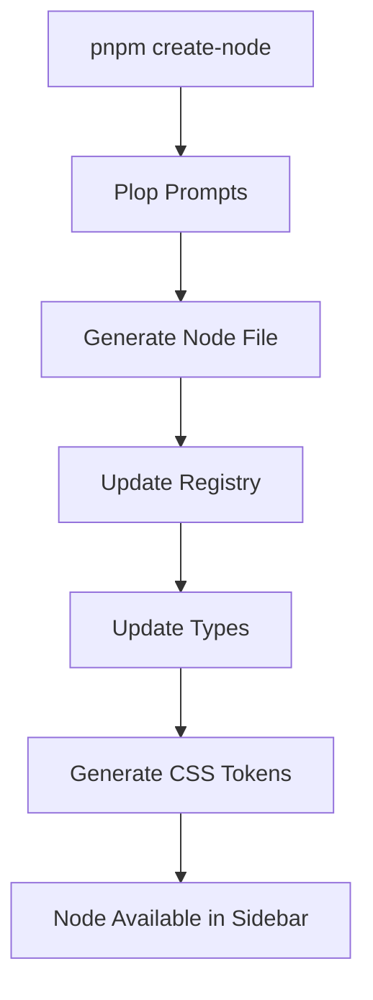
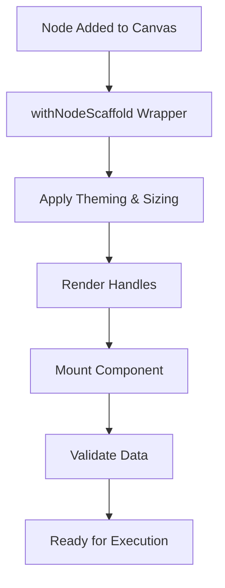

# AgenitiX Node Architecture Report

> **Comprehensive analysis of how nodes are created, managed, and executed in the AgenitiX workflow automation platform**

---

## 🏗️ **Architecture Overview**

AgenitiX implements a sophisticated **NodeSpec-based architecture** that provides enterprise-grade node management with type safety, visual consistency, and automated code generation. The system is built around a **single source of truth** principle where each node is defined by a comprehensive specification.

### **Core Architecture Principles**
- **NodeSpec as Single Source of Truth** - All node metadata comes from one specification
- **Domain-Driven Organization** - Nodes organized by functional domains (create, view, trigger, test, cycle)
- **Scaffold Pattern** - Separation of structural styling from content logic
- **Registry-Based Management** - Centralized node discovery and metadata
- **Type-Safe Validation** - Zod schema-driven data validation
- **Automated Code Generation** - Plop-based node scaffolding

---

## 📋 **NodeSpec: The Foundation**

### **NodeSpec Interface**
```typescript
interface NodeSpec {
  kind: string;                    // Unique identifier (e.g., 'createText')
  displayName: string;             // Human-readable name
  category: NodeCategory;          // Functional category (CREATE, VIEW, etc.)
  size: {                         // Visual sizing configuration
    expanded: ExpandedSize;
    collapsed: CollapsedSize;
  };
  handles: NodeHandleSpec[];       // Input/output connection points
  inspector: { key: string };      // Inspector panel configuration
  initialData: Record<string, any>; // Default node data
  dataSchema?: z.ZodSchema<any>;   // Runtime validation schema
  controls?: ControlsConfig;       // Auto-generated UI controls
  version?: number;                // Schema version for migrations
  runtime?: { execute?: string };  // Execution handler identifier
}
```

### **Handle Specification**
```typescript
interface NodeHandleSpec {
  id: string;                      // Unique handle identifier
  dataType?: string;               // Legacy data type code
  tsSymbol?: string;               // TypeScript type symbol
  code?: string;                   // Fallback code
  position: 'top' | 'bottom' | 'left' | 'right';
  type: 'source' | 'target';
}
```

---

## 🎨 **Visual System Architecture**

### **Theming & Design Tokens**
The visual system is built on a comprehensive token-based design system:

```json
{
  "node": {
    "create": {
      "bg": "hsla(140, 100%, 1%, 1)",
      "border": "hsla(140, 100%, 20%, 1)",
      "text": "hsla(0, 0%, 15%, 1)"
    },
    "view": { /* VIEW category tokens */ },
    "trigger": { /* TRIGGER category tokens */ }
  }
}
```

### **Sizing System**
Standardized sizing constants ensure visual consistency:

```typescript
// Collapsed sizes (compact state)
const COLLAPSED_SIZES = {
  C1: { width: 60, height: 60 },      // Default collapsed
  C1W: { width: 120, height: 60 },    // Wide collapsed
  C2: { width: 120, height: 120 },    // Large collapsed
  C3: { width: 180, height: 180 }     // Extra large collapsed
};

// Expanded sizes (detailed state)
const EXPANDED_SIZES = {
  FE1: { width: 120, height: 120 },   // Fixed expanded
  VE2: { width: 180, height: 'auto' } // Variable height
};
```

### **Category-Based Theming**
Each node category has distinct visual identity:
- **CREATE** - Green theme for content creation nodes
- **VIEW** - Blue theme for data visualization nodes  
- **TRIGGER** - Yellow theme for event-driven nodes
- **TEST** - Red theme for testing and validation nodes
- **CYCLE** - Purple theme for iterative operations

---

## 🔧 **Node Creation Process**

### **1. Automated Node Generation (Plop)**
```bash
# Interactive node creation
pnpm create-node

# Prompts for:
# - kind: Node identifier (e.g., 'emailSend')
# - domain: Functional domain (create/view/trigger/test/cycle)
# - category: Visual category (CREATE/VIEW/TRIGGER/TEST/CYCLE)
# - collapsedSize: Compact visual size (C1/C1W/C2/C3)
# - expandedSize: Detailed visual size (FE1/VE2/etc.)
# - tsSymbol: Optional TypeScript type symbol
```

### **2. Generated Node Structure**
```typescript
/**
 * EMAIL SEND NODE - AI-powered email automation
 */
import type { NodeProps } from "@xyflow/react";
import { z } from "zod";
import type { NodeSpec } from "@/infrastructure/node-core/NodeSpec";
import { withNodeScaffold } from "@/infrastructure/node-core/withNodeScaffold";

// Data validation schema
const EmailSendDataSchema = z.object({
  recipient: z.string().email().default(""),
  subject: z.string().default(""),
  body: z.string().default(""),
  isActive: z.boolean().default(false),
  isExpanded: z.boolean().default(false),
}).passthrough();

type EmailSendData = z.infer<typeof EmailSendDataSchema>;

// Node specification (single source of truth)
const spec: NodeSpec = {
  kind: "emailSend",
  displayName: "Email Send",
  category: CATEGORIES.CREATE,
  size: {
    expanded: EXPANDED_SIZES.VE2,
    collapsed: COLLAPSED_SIZES.C1W,
  },
  handles: [
    { id: "email-data", position: "left", type: "target" },
    { id: "success", position: "right", type: "source" },
    { id: "error", position: "bottom", type: "source" }
  ],
  inspector: { key: "EmailSendInspector" },
  initialData: { recipient: "", subject: "", body: "", isActive: false, isExpanded: false },
  dataSchema: EmailSendDataSchema,
  version: 1,
  runtime: { execute: "emailSend_execute_v1" }
};

// Node component (content-focused)
const EmailSendNodeComponent = ({ data, id }: NodeProps) => {
  const { nodeData, updateNodeData } = useNodeData(id, data);
  const validationResult = validateNodeData(nodeData);
  
  return (
    <div className="p-4">
      {/* Node-specific UI content */}
      <input 
        value={validationResult.data.recipient}
        onChange={(e) => updateNodeData({ recipient: e.target.value })}
        placeholder="Recipient email"
      />
      {/* Additional UI elements */}
    </div>
  );
};

// Export with scaffold wrapper
export default withNodeScaffold(spec, EmailSendNodeComponent);
export { spec };
```

### **3. Automatic Registry Updates**
When a node is created, Plop automatically updates:

```typescript
// useDynamicNodeTypes.ts - React Flow integration
const nodeTypes = useMemo(() => ({
  createText,
  emailSend,  // ← Automatically added
}), []);

// nodespec-registry.ts - Metadata registry
const nodeSpecs: Record<string, NodeSpec> = {
  createText: createTextSpec,
  emailSend: emailSendSpec,  // ← Automatically added
};

// node-domain/index.ts - Module exports
export { default as createText } from './create/createText.node';
export { default as emailSend } from './create/emailSend.node';  // ← Automatically added
```

---

## 🎭 **Scaffold System Architecture**

### **withNodeScaffold Higher-Order Component**
The scaffold system separates structural concerns from content logic:

```typescript
export function withNodeScaffold(
  spec: NodeSpec,
  Component: React.FC<NodeProps>
) {
  return (props: NodeProps) => {
    // Extract theming and state
    const isSelected = props.selected || false;
    const isExpanded = props.data?.isExpanded || false;
    const categoryTheme = useCategoryTheme(spec.kind);
    
    // Apply sizing based on expanded state
    const currentSize = isExpanded ? spec.size.expanded : spec.size.collapsed;
    
    // Render with complete structural styling
    return (
      <NodeScaffoldWrapper style={sizeStyles} className={themeClasses} spec={spec}>
        {/* Handles from spec */}
        {spec.handles?.map(handle => (
          <TypeSafeHandle key={handle.id} {...handle} />
        ))}
        
        {/* Error boundary and telemetry */}
        <NodeErrorBoundary nodeId={props.id}>
          <NodeTelemetry nodeId={props.id} nodeKind={spec.kind} />
          <Component {...props} />
        </NodeErrorBoundary>
      </NodeScaffoldWrapper>
    );
  };
}
```

### **Scaffold Responsibilities**
- **Structural Styling** - Borders, shadows, sizing, rounded corners
- **Category Theming** - Background colors, border colors based on category
- **Interactive States** - Hover, selection, activation, error states
- **Handle Rendering** - Automatic handle positioning and styling
- **Error Boundaries** - Per-node error isolation
- **Telemetry** - Usage tracking and analytics
- **Label Management** - Editable node labels

---

## 🔍 **Validation & Type Safety**

### **Enterprise-Grade Validation System**
```typescript
// Create validator with comprehensive error handling
const validateNodeData = createNodeValidator(EmailSendDataSchema, "EmailSend");

// Validation with fallback and error reporting
const validationResult = validateNodeData(nodeData);
if (!validationResult.success) {
  // Automatic error reporting to monitoring service
  reportValidationError("EmailSend", nodeId, validationResult.errors);
  // Use safe fallback data
  return validationResult.data; // Schema defaults
}
```

### **Validation Features**
- **Runtime Type Safety** - Zod schema validation
- **Automatic Fallbacks** - Safe defaults when validation fails
- **Error Tracking** - Integration with monitoring services
- **Performance Metrics** - Validation health scores
- **Development Warnings** - Non-blocking error reporting
- **Schema Versioning** - Migration support for data changes

### **Common Validation Schemas**
```typescript
export const CommonSchemas = {
  text: z.string().min(1).max(10000).refine(/* no script tags */),
  email: z.string().email().max(254),
  url: z.string().url().refine(/* HTTPS only */),
  positiveInt: z.number().int().positive(),
  safeHtml: z.string().refine(/* sanitized HTML */),
  jsonObject: z.record(z.unknown()).refine(/* size limits */)
};
```

---

## 📊 **Registry & Discovery System**

### **NodeSpec Registry Architecture**
```typescript
// Single source of truth registry
const nodeSpecs: Record<string, NodeSpec> = {
  createText: createTextSpec,
  emailSend: emailSendSpec,
  // Auto-populated by Plop
};

// Enhanced metadata with UI properties
interface NodeSpecMetadata extends NodeSpec {
  description: string;
  icon: string;
  ui: {
    defaultCollapsed: boolean;
    folder: string;
    order: number;
  };
}
```

### **Discovery Functions**
```typescript
// Get node by type
const nodeMetadata = getNodeSpecMetadata('emailSend');

// Get all nodes in category
const createNodes = getNodesByCategory('CREATE');

// Get all available categories
const categories = getAllCategories(); // ['CREATE', 'VIEW', 'TRIGGER', ...]

// Validate node existence
const validation = validateNode('emailSend');
// { isValid: true, warnings: [], suggestions: [] }
```

### **Sidebar Integration**
The sidebar automatically discovers and organizes nodes:
```typescript
// Automatic categorization
const nodesByCategory = getAllCategories().map(category => ({
  category,
  nodes: getNodesByCategory(category)
}));

// Drag-and-drop node creation
const handleNodeDrag = (nodeType: string) => {
  const metadata = getNodeSpecMetadata(nodeType);
  return {
    type: nodeType,
    data: metadata.initialData
  };
};
```

---

## ⚡ **Runtime Execution System**

### **Execution Architecture**
```typescript
// Runtime executor mapping
const executors = {
  'emailSend_execute_v1': async (nodeData, inputs, context) => {
    // Email sending logic
    const { recipient, subject, body } = nodeData;
    const result = await sendEmail({ recipient, subject, body });
    return { success: true, messageId: result.id };
  }
};

// Execution context
interface ExecutionContext {
  nodeId: string;
  flowId: string;
  userId: string;
  credentials: CredentialStore;
  logger: Logger;
}
```

### **Flow Execution**
```typescript
// Execute node in workflow context
const executeNode = async (nodeId: string, inputs: any) => {
  const node = getNodeById(nodeId);
  const spec = getNodeSpecMetadata(node.type);
  
  if (spec.runtime?.execute) {
    const executor = executors[spec.runtime.execute];
    return await executor(node.data, inputs, executionContext);
  }
};
```

---

## 🔄 **Node Lifecycle Management**

### **1. Creation Lifecycle**


### **2. Runtime Lifecycle**


### **3. Update Lifecycle**
```typescript
// Real-time data updates
const { nodeData, updateNodeData } = useNodeData(nodeId, initialData);

// Update with validation
const handleUpdate = (updates: Partial<NodeData>) => {
  const validator = createUpdateValidator(schema, nodeType);
  const validatedData = validator(nodeData, updates, nodeId);
  updateNodeData(validatedData);
};
```

---

## 🎯 **Domain Organization**

### **Domain Structure**
```
node-domain/
├── create/          # Content creation nodes
│   ├── createText.node.tsx
│   ├── createEmail.node.tsx
│   └── createImage.node.tsx
├── view/            # Data visualization nodes
│   ├── viewTable.node.tsx
│   └── viewChart.node.tsx
├── trigger/         # Event-driven nodes
│   ├── webhookTrigger.node.tsx
│   └── scheduleTrigger.node.tsx
├── test/            # Testing and validation nodes
│   └── testEmail.node.tsx
└── cycle/           # Iterative operation nodes
    └── forEach.node.tsx
```

### **Domain-Specific Features**
Each domain can have specialized:
- **Base schemas** - Common validation patterns
- **Shared components** - Reusable UI elements
- **Domain utilities** - Helper functions
- **Category theming** - Visual consistency

---

## 🛠️ **Development Workflow**

### **Creating a New Node**
```bash
# 1. Generate node scaffold
pnpm create-node

# 2. Customize node logic
# Edit: features/business-logic-modern/node-domain/{domain}/{kind}.node.tsx

# 3. Add custom validation
const CustomSchema = z.object({
  customField: CommonSchemas.email,
  // ... other fields
});

# 4. Implement UI
const NodeComponent = ({ data, id }) => {
  // Custom UI implementation
};

# 5. Test in development
pnpm dev
```

### **Node Deletion**
```bash
# Comprehensive cleanup
pnpm plop delete-node

# Automatically removes:
# - Node file
# - Registry entries  
# - Type definitions
# - Generated files
# - Migration references
# - Documentation references
```

---

## 📈 **Performance & Optimization**

### **Lazy Loading**
```typescript
// Dynamic imports for performance
const createText = React.lazy(
  () => import("../../../node-domain/create/createText.node")
);

// Only load nodes when needed
const nodeTypes = useMemo(() => ({
  createText,
  // Other nodes loaded on demand
}), []);
```

### **Validation Caching**
```typescript
// Validation metrics for optimization
const validationMetrics = new Map<string, ValidationMetrics>();

// Health scoring for monitoring
const healthScore = getValidationHealthScore('emailSend'); // 0-100
```

### **Memory Management**
- **Error boundaries** prevent memory leaks from failed nodes
- **Telemetry cleanup** on node unmount
- **Validation cache** with size limits
- **Schema reuse** across node instances

---

## 🔒 **Security & Enterprise Features**

### **Data Validation Security**
```typescript
// XSS prevention
const safeText = z.string().refine(
  text => !/<script\b[^<]*(?:(?!<\/script>)<[^<]*)*<\/script>/gi.test(text),
  "Script tags not allowed"
);

// Path traversal prevention  
const safePath = z.string().refine(
  path => !path.includes(".."),
  "Path traversal not allowed"
);
```

### **Error Tracking Integration**
```typescript
// Enterprise error monitoring
export const SentryErrorTracking: ErrorTrackingService = {
  captureError: (error, context) => {
    Sentry.captureException(error, { extra: context });
  }
};

// Automatic error reporting
if (process.env.NODE_ENV === 'production') {
  initializeErrorTracking(SentryErrorTracking);
}
```

### **Audit & Compliance**
- **Validation logging** - All validation failures tracked
- **Node telemetry** - Usage analytics and performance monitoring  
- **Data sanitization** - Automatic XSS and injection prevention
- **Access control** - Role-based node permissions (planned)

---

## 🚀 **Advanced Features**

### **Auto-Generated Inspector Controls**
```typescript
// Schema-driven UI generation
const spec: NodeSpec = {
  dataSchema: EmailSendDataSchema,
  controls: {
    autoGenerate: true,
    customFields: [
      {
        key: "recipient",
        type: "email",
        label: "Recipient Email",
        required: true
      }
    ],
    fieldGroups: [
      {
        title: "Email Content",
        fields: ["subject", "body"],
        collapsible: true
      }
    ]
  }
};
```

### **Migration System**
```typescript
// Schema versioning for data migration
const spec: NodeSpec = {
  version: 2,
  runtime: {
    execute: "emailSend_execute_v2" // Updated executor
  }
};

// Automatic data migration
const migrateNodeData = (data: any, fromVersion: number, toVersion: number) => {
  // Migration logic based on version differences
};
```

### **Plugin System**
```typescript
// Node plugins for extended functionality
const nodePlugins = [
  TelemetryPlugin,
  ValidationPlugin,
  SecurityPlugin
];

// Automatic plugin application
getNodePlugins().map(Plugin => (
  <Plugin nodeId={nodeId} nodeKind={spec.kind} data={data} />
));
```

---

## 📊 **Metrics & Monitoring**

### **Node Performance Metrics**
```typescript
interface NodeMetrics {
  executionTime: number;
  memoryUsage: number;
  errorRate: number;
  validationHealth: number;
  usageCount: number;
}

// Real-time monitoring
const metrics = getNodeMetrics('emailSend');
// { executionTime: 150ms, errorRate: 0.02%, validationHealth: 98% }
```

### **System Health Dashboard**
- **Validation health scores** per node type
- **Error rates** and failure patterns
- **Performance metrics** and bottlenecks
- **Usage analytics** and adoption rates

---

## 🎯 **Key Architectural Strengths**

### **1. Single Source of Truth**
- **NodeSpec** contains all node metadata
- **No duplication** across registry files
- **Automatic consistency** through code generation

### **2. Type Safety**
- **Runtime validation** with Zod schemas
- **TypeScript integration** throughout
- **Compile-time error prevention**

### **3. Visual Consistency**
- **Token-based theming** system
- **Standardized sizing** constants
- **Category-based** visual identity

### **4. Developer Experience**
- **Automated scaffolding** with Plop
- **Hot reloading** during development
- **Comprehensive error handling**

### **5. Enterprise Readiness**
- **Error tracking** integration
- **Performance monitoring**
- **Security validation**
- **Audit logging**

### **6. Extensibility**
- **Plugin system** for additional functionality
- **Domain organization** for scalability
- **Migration system** for schema evolution

---

## 🔮 **Future Enhancements**

### **Planned Features**
- **Visual Node Builder** - Drag-and-drop node creation UI
- **Node Marketplace** - Community-driven node sharing
- **Advanced AI Integration** - LLM-powered node generation
- **Real-time Collaboration** - Multi-user node editing
- **Custom Execution Engines** - Pluggable runtime systems

### **Architecture Evolution**
- **Micro-frontend** node loading
- **WebAssembly** execution for performance
- **Distributed execution** across multiple workers
- **Advanced caching** strategies

---

**AgenitiX's node architecture represents a sophisticated, enterprise-grade system that balances developer productivity, type safety, visual consistency, and runtime performance. The NodeSpec-based approach provides a solid foundation for building complex workflow automation systems while maintaining code quality and user experience.**