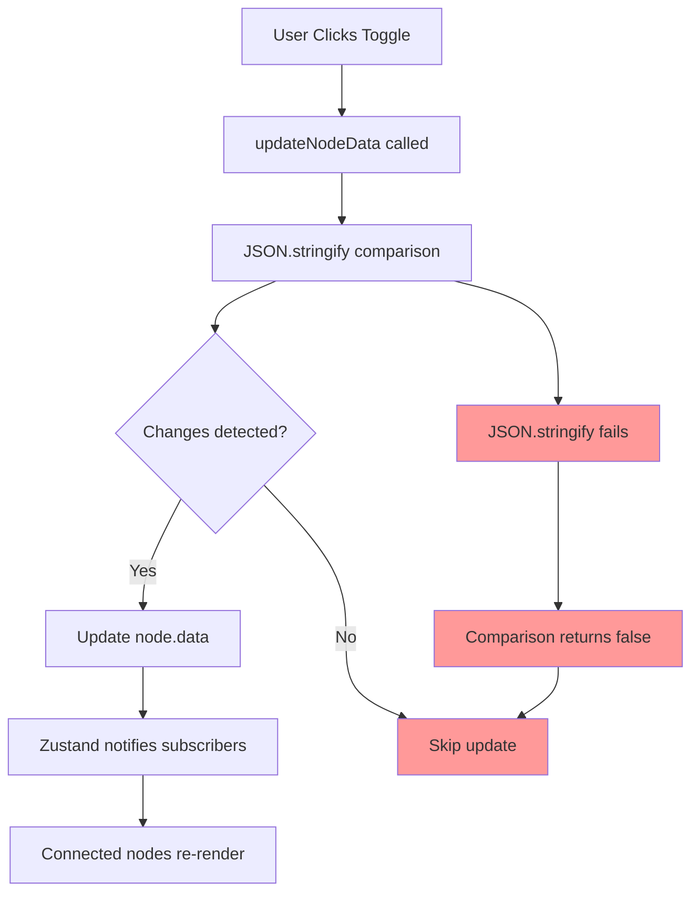
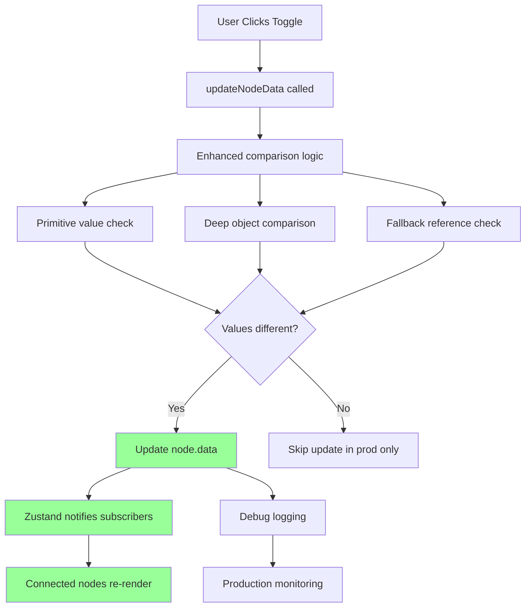

# Design Document - Data Propagation Bug Fix

## Overview

This design addresses the data propagation bug that occurs in production environments where node state changes don't properly propagate through the workflow. The issue stems from state comparison logic in the Zustand store and hydration mismatches between server and client rendering.

## Architecture

### Current Architecture Issues



### Proposed Architecture



## Components and Interfaces

### 1. Enhanced State Comparison

```typescript
interface StateComparisonResult {
  hasChanges: boolean;
  changedKeys: string[];
  comparisonMethod: 'primitive' | 'deep' | 'fallback';
  error?: string;
}

interface StateComparator {
  compare(current: any, incoming: any): StateComparisonResult;
  handleComparisonError(error: Error, key: string): boolean;
}
```

### 2. Production Debug Hook

```typescript
interface ProductionDebugConfig {
  nodeId: string;
  logStateChanges?: boolean;
  logHydration?: boolean;
  detectStuckState?: boolean;
}

interface DebugUtilities {
  forceRefresh(): void;
  getDebugInfo(): DebugInfo;
  logCurrentState(): void;
}

interface DebugInfo {
  nodeId: string;
  hasHydrated: boolean;
  stateChangeCount: number;
  timeSinceLastChange: number;
  currentData: any;
}
```

### 3. Hydration Manager

```typescript
interface HydrationManager {
  isHydrated(): boolean;
  waitForHydration(): Promise<void>;
  forceHydration(): void;
  onHydrationComplete(callback: () => void): void;
}
```

## Data Models

### Node State Update Flow

```typescript
interface NodeStateUpdate {
  nodeId: string;
  data: Partial<Record<string, unknown>>;
  timestamp: number;
  source: 'user' | 'propagation' | 'hydration';
}

interface StateUpdateResult {
  success: boolean;
  changedKeys: string[];
  previousData: any;
  newData: any;
  comparisonMethod: string;
}
```

### Debug Event Tracking

```typescript
interface DebugEvent {
  type: 'state_change' | 'hydration' | 'stuck_state' | 'comparison_error';
  nodeId: string;
  timestamp: number;
  data: any;
  environment: 'development' | 'production';
}
```

## Error Handling

### 1. Comparison Errors
- **JSON.stringify failures**: Fallback to reference comparison
- **Circular references**: Use structured clone or custom serializer
- **Undefined/null values**: Handle edge cases explicitly

### 2. Hydration Errors
- **State mismatch**: Force client-side state update
- **Timing issues**: Implement retry mechanism with exponential backoff
- **localStorage corruption**: Clear and reinitialize state

### 3. Production Monitoring
- **Silent failures**: Log to console in production with debug flag
- **Performance degradation**: Monitor comparison times and alert if > 10ms
- **Memory leaks**: Track state update frequency and cleanup

## Testing Strategy

### Unit Tests
- State comparison logic with various data types
- Edge cases: circular references, large objects, null values
- Performance tests for comparison algorithms

### Integration Tests
- Full node update flow from UI to state propagation
- Hydration scenarios with different localStorage states
- Multi-node workflows with rapid state changes

### Production Tests
- A/B testing with enhanced vs original comparison logic
- Performance monitoring in production environment
- User acceptance testing with real workflows

### Environment-Specific Tests
- Development vs production behavior comparison
- SSR hydration testing
- localStorage persistence testing

## Implementation Phases

### Phase 1: Enhanced State Comparison
1. Implement improved comparison logic in flowStore
2. Add error handling and fallback mechanisms
3. Add debug logging for production environments

### Phase 2: Production Debug Tools
1. Create useProductionDebug hook
2. Integrate debug utilities into trigger nodes
3. Add monitoring and alerting capabilities

### Phase 3: Hydration Improvements
1. Implement hydration manager
2. Add retry mechanisms for failed hydrations
3. Improve localStorage state management

### Phase 4: Testing and Validation
1. Comprehensive testing across environments
2. Performance optimization
3. User acceptance testing

## Performance Considerations

### Optimization Strategies
- **Memoization**: Cache comparison results for identical objects
- **Batching**: Group multiple state updates into single operations
- **Lazy evaluation**: Only perform deep comparisons when necessary
- **Worker threads**: Move heavy comparisons to web workers if needed

### Performance Metrics
- State comparison time: < 10ms for typical node data
- Memory usage: Stable across multiple updates
- UI responsiveness: No blocking during state updates
- Network impact: Minimal additional data transfer

## Security Considerations

### Data Protection
- Ensure debug logs don't expose sensitive data
- Sanitize state data before logging
- Implement proper access controls for debug features

### Production Safety
- Debug features only enabled with explicit flags
- No sensitive information in console logs
- Graceful degradation if debug features fail