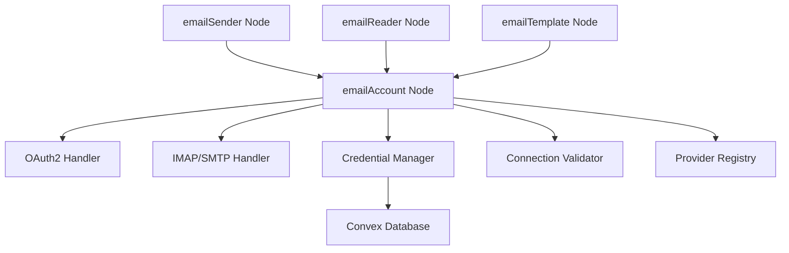

# Email System Design Document

## Overview

The email system is built around a foundational `emailAccount` node that manages authentication and connection to email providers. This node serves as the authentication hub for all other email-related nodes in the system.

## Architecture

### Core Components



### Data Flow

1. **Authentication Flow**: User configures provider → OAuth2/Manual auth → Credentials stored in Convex
2. **Validation Flow**: Connection test → Provider API call → Status update
3. **Integration Flow**: Other email nodes → Query available accounts → Use selected account

## Components and Interfaces

### 1. EmailAccount Node Component

**File**: `features/business-logic-modern/node-domain/email/emailAccount.node.tsx`

**Key Features**:
- Provider selection (Gmail, Outlook, IMAP/SMTP)
- OAuth2 authentication flow
- Manual credential configuration
- Connection testing and validation
- Account information display

**Node Handles**:
```typescript
handles: [
  {
    id: "trigger-input",
    code: "t",
    position: "top",
    type: "target",
    dataType: "Boolean", // Trigger connection test
  },
  {
    id: "account-output",
    code: "a",
    position: "right",
    type: "source",
    dataType: "JSON", // Account configuration object
  },
  {
    id: "status-output",
    code: "s",
    position: "bottom",
    type: "source",
    dataType: "Boolean", // Connection status (true/false)
  },
]
```

### 2. Provider Registry

**File**: `features/business-logic-modern/node-domain/email/providers/index.ts`

```typescript
interface EmailProvider {
  id: string;
  name: string;
  authType: 'oauth2' | 'manual';
  configFields: ConfigField[];
  validateConnection: (config: any) => Promise<boolean>;
}

const providers: EmailProvider[] = [
  {
    id: 'gmail',
    name: 'Gmail',
    authType: 'oauth2',
    configFields: [],
    validateConnection: validateGmailConnection,
  },
  // ... other providers
];
```

### 3. Credential Manager

**File**: `convex/email-accounts.ts`

```typescript
// Store encrypted email credentials
export const storeEmailAccount = mutation({
  args: {
    token_hash: v.string(),
    provider: v.string(),
    email: v.string(),
    credentials: v.any(), // Encrypted credential object
    display_name: v.optional(v.string()),
  },
  handler: async (ctx, args) => {
    // Validate user session
    // Encrypt credentials
    // Store in email_accounts table
  },
});

export const getEmailAccounts = query({
  args: { token_hash: v.string() },
  handler: async (ctx, args) => {
    // Return user's email accounts (without sensitive data)
  },
});
```

### 4. OAuth2 Handler

**File**: `app/api/auth/email/[provider]/route.ts`

```typescript
// Handle OAuth2 flows for different providers
export async function GET(request: Request, { params }: { params: { provider: string } }) {
  const { provider } = params;
  
  switch (provider) {
    case 'gmail':
      return handleGmailOAuth(request);
    case 'outlook':
      return handleOutlookOAuth(request);
    default:
      return new Response('Unsupported provider', { status: 400 });
  }
}
```

## Data Models

### EmailAccount Schema (Convex)

```typescript
email_accounts: defineTable({
  user_id: v.id("auth_users"),
  provider: v.string(), // 'gmail', 'outlook', 'imap', 'smtp'
  email: v.string(),
  display_name: v.optional(v.string()),
  credentials: v.string(), // Encrypted JSON string
  is_active: v.boolean(),
  last_validated: v.optional(v.number()),
  created_at: v.number(),
  updated_at: v.number(),
})
.index("by_user_id", ["user_id"])
.index("by_provider", ["provider"])
.index("by_email", ["email"]),
```

### Node Data Schema

```typescript
export const EmailAccountDataSchema = z.object({
  provider: z.enum(["gmail", "outlook", "imap", "smtp"]).default("gmail"),
  email: z.string().default(""),
  displayName: z.string().default(""),
  isConfigured: z.boolean().default(false),
  isConnected: z.boolean().default(false),
  connectionStatus: z.string().default("disconnected"),
  lastValidated: z.number().optional(),
  accountId: z.string().optional(), // Convex document ID
  
  // Manual configuration (for IMAP/SMTP)
  imapHost: z.string().default(""),
  imapPort: z.number().default(993),
  smtpHost: z.string().default(""),
  smtpPort: z.number().default(587),
  username: z.string().default(""),
  password: z.string().default(""),
  
  // UI state
  isEnabled: z.boolean().default(true),
  isActive: z.boolean().default(false),
  isExpanded: z.boolean().default(false),
  expandedSize: z.string().default("VE2"),
  collapsedSize: z.string().default("C2"),
});
```

## Error Handling

### Error Types

```typescript
type EmailAccountError = 
  | "AUTHENTICATION_FAILED"
  | "CONNECTION_TIMEOUT"
  | "INVALID_CREDENTIALS"
  | "PROVIDER_ERROR"
  | "RATE_LIMIT_EXCEEDED"
  | "NETWORK_ERROR"
  | "CONFIGURATION_INVALID";
```

### Error Recovery Strategies

1. **Authentication Failures**: Prompt for re-authentication
2. **Network Issues**: Retry with exponential backoff
3. **Rate Limits**: Display wait time and auto-retry
4. **Configuration Errors**: Highlight invalid fields with suggestions

## Testing Strategy

### Unit Tests

1. **Provider Configuration**: Test each provider's config validation
2. **Credential Encryption**: Verify encryption/decryption works
3. **Connection Validation**: Mock API calls and test responses
4. **Error Handling**: Test all error scenarios

### Integration Tests

1. **OAuth2 Flow**: End-to-end authentication testing
2. **Database Operations**: Test Convex mutations and queries
3. **Node Integration**: Test with other email nodes
4. **UI Interactions**: Test expand/collapse, configuration forms

### Manual Testing Checklist

1. **Gmail OAuth2**: Complete authentication flow
2. **Outlook OAuth2**: Complete authentication flow  
3. **IMAP/SMTP**: Manual configuration and validation
4. **Connection Testing**: Test connection button functionality
5. **Error States**: Trigger various error conditions
6. **Account Management**: Add/remove/update accounts
7. **Integration**: Connect to emailSender/emailReader nodes

## Security Considerations

### Credential Protection

1. **Encryption**: All credentials encrypted before storage
2. **Access Control**: User-scoped access to credentials
3. **Session Validation**: Verify user session for all operations
4. **Audit Logging**: Log authentication and access events

### OAuth2 Security

1. **State Parameter**: Prevent CSRF attacks
2. **Secure Redirect**: Validate redirect URLs
3. **Token Storage**: Secure token handling and refresh
4. **Scope Limitation**: Request minimal required permissions

## Implementation Phases

### Phase 1: Core Infrastructure
- [ ] Create emailAccount node structure
- [ ] Implement provider registry
- [ ] Set up Convex schema and mutations
- [ ] Basic UI for provider selection

### Phase 2: Authentication
- [ ] Implement OAuth2 handlers for Gmail/Outlook
- [ ] Add manual IMAP/SMTP configuration
- [ ] Credential encryption and storage
- [ ] Connection validation

### Phase 3: Integration & Testing
- [ ] Integration with other email nodes
- [ ] Comprehensive error handling
- [ ] UI polish and user experience
- [ ] Testing and documentation

## Performance Considerations

1. **Connection Caching**: Cache connection status to avoid repeated API calls
2. **Credential Encryption**: Use efficient encryption for frequent access
3. **Rate Limiting**: Implement client-side rate limiting for API calls
4. **Lazy Loading**: Load account details only when needed