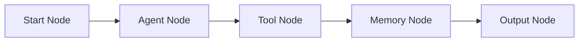
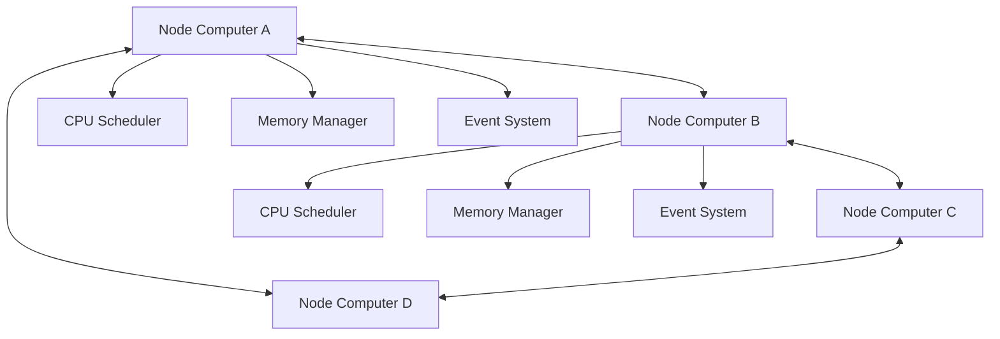

# AgenitiX vs FlowiseAI AgentFlow v2 - Architectural Comparison

> **Detailed analysis of how AgenitiX's node architecture compares to FlowiseAI's AgentFlow v2 system**

---

## 🏗️ **Architecture Philosophy**

### **FlowiseAI AgentFlow v2**
- **AI-First Design** - Built specifically for LangChain and AI workflows
- **Agent-Centric** - Focuses on AI agents with tools and memory
- **Linear Flow** - Traditional workflow with start → process → end
- **Stateless Nodes** - Nodes don't maintain independent state
- **Centralized Memory** - Shared memory across the entire flow

### **AgenitiX NodeSpec Architecture**
- **General-Purpose Platform** - Built for any type of workflow automation
- **Node-Centric** - Each node is an independent programmable computer
- **Distributed Computing** - Nodes can run independently and communicate
- **Stateful Nodes** - Each node has its own memory, CPU, scheduler
- **Isolated Memory** - Per-node memory spaces with inter-node communication

---

## 🧠 **Memory Architecture**

### **FlowiseAI Memory Model**
```typescript
// FlowiseAI - Centralized memory shared across flow
{
  "sessionId": "user-123",
  "chatHistory": [...],
  "vectorStore": "shared-embeddings",
  "agentState": "global-state"
}
```

**Characteristics:**
- **Shared Memory** - All nodes access the same memory space
- **Session-Based** - Memory tied to user sessions
- **AI-Focused** - Optimized for chat history and embeddings
- **No Isolation** - Nodes can interfere with each other's data

### **AgenitiX Memory Model**
```typescript
// AgenitiX - Per-node isolated memory computers
const nodeA_memory = {
  maxSize: 50 * 1024 * 1024,
  evictionPolicy: 'LRU',
  persistent: true,
  analytics: true
};

const nodeB_memory = {
  maxSize: 10 * 1024 * 1024,
  evictionPolicy: 'TTL',
  persistent: false,
  analytics: true
};
```

**Characteristics:**
- **Isolated Memory** - Each node has its own memory space
- **Configurable** - Per-node memory configuration
- **Multi-Purpose** - Not limited to AI/chat use cases
- **Secure Isolation** - Nodes cannot access each other's memory
- **Advanced Management** - LRU, LFU, FIFO, TTL eviction policies

---

## ⚡ **Execution Model**

### **FlowiseAI Execution**


**Characteristics:**
- **Sequential Flow** - Linear execution path
- **Agent-Driven** - AI agent orchestrates the flow
- **Tool-Based** - Nodes are primarily tools for the agent
- **Centralized Control** - Single agent controls execution

### **AgenitiX Execution**


**Characteristics:**
- **Distributed Execution** - Nodes run independently
- **Event-Driven** - Nodes communicate via events and messages
- **Parallel Processing** - Multiple nodes can execute simultaneously
- **Decentralized Control** - Each node manages its own execution

---

## 🔧 **Node Capabilities**

### **FlowiseAI Node Types**
```typescript
// FlowiseAI - Limited to AI/LangChain ecosystem
{
  "LLM Nodes": ["OpenAI", "Anthropic", "Cohere"],
  "Memory Nodes": ["Buffer Memory", "Vector Store"],
  "Tool Nodes": ["Calculator", "Web Search", "API Call"],
  "Agent Nodes": ["ReAct Agent", "Plan Execute Agent"]
}
```

**Limitations:**
- **AI-Specific** - Primarily for LangChain workflows
- **Pre-built Tools** - Limited to existing tool integrations
- **No Custom Logic** - Cannot create complex custom nodes
- **No Independent State** - Nodes don't maintain their own state

### **AgenitiX Node Capabilities**
```typescript
// AgenitiX - Full programmable computer per node
const nodeSpec: EnhancedNodeSpec = {
  // Complete computer architecture
  memory: { maxSize: 50MB, persistent: true },
  cpu: { maxConcurrency: 3, profiling: true },
  scheduler: { cronSupport: true, maxTasks: 10 },
  events: { customEvents: ['data-processed'] },
  security: { sandbox: true, resourceLimits: true },
  communication: { messaging: true, broadcast: true },
  
  // Custom execution logic
  runtime: {
    execute: "customBusinessLogic",
    init: "setupResources",
    cleanup: "cleanupResources"
  },
  
  // Lifecycle management
  lifecycle: {
    onCreate: "initialize",
    onDataChange: "reactToChanges",
    onError: "handleErrors"
  }
}
```

**Advantages:**
- **Universal Platform** - Any type of workflow, not just AI
- **Custom Logic** - Full programming capabilities per node
- **Independent State** - Each node is a mini computer
- **Advanced Features** - Scheduling, events, security, monitoring

---

## 🎯 **Use Case Comparison**

### **FlowiseAI - Best For:**
```typescript
// AI Chatbot with RAG
const flowiseFlow = {
  input: "User question",
  retrieval: "Vector search in knowledge base",
  llm: "Generate response with context",
  memory: "Store conversation history",
  output: "AI response"
};
```

**Strengths:**
- **Quick AI Setup** - Fast chatbot/agent creation
- **LangChain Integration** - Deep AI ecosystem integration
- **Pre-built Components** - Ready-to-use AI tools
- **Chat-Optimized** - Excellent for conversational AI

### **AgenitiX - Best For:**
```typescript
// Complex Business Automation
const agentixFlow = {
  emailProcessor: {
    memory: "Cache templates and user data",
    cpu: "Process emails in parallel",
    scheduler: "Send follow-ups automatically",
    events: "React to user interactions"
  },
  
  dataAnalyzer: {
    memory: "Store analysis results",
    cpu: "Run ML models",
    scheduler: "Generate daily reports",
    communication: "Coordinate with other nodes"
  },
  
  apiIntegrator: {
    memory: "Cache API responses",
    cpu: "Handle rate limiting",
    scheduler: "Sync data periodically",
    security: "Manage API credentials"
  }
};
```

**Strengths:**
- **Complex Workflows** - Multi-step business processes
- **Stateful Operations** - Nodes remember and learn
- **Parallel Processing** - Multiple operations simultaneously
- **Custom Logic** - Any business logic imaginable

---

## 🔍 **Technical Deep Dive**

### **FlowiseAI Node Structure**
```typescript
// FlowiseAI - Simple node interface
interface FlowiseNode {
  id: string;
  type: "llm" | "memory" | "tool" | "agent";
  inputs: Record<string, any>;
  outputs: Record<string, any>;
  config: Record<string, any>;
}

// Execution is handled by the flow engine
const result = await flowEngine.execute(nodes, inputs);
```

### **AgenitiX Node Structure**
```typescript
// AgenitiX - Complete computer interface
interface AgentixNode {
  // Basic identification
  kind: string;
  displayName: string;
  
  // Computer subsystems
  memory: NodeMemoryConfig;
  cpu: NodeCPUConfig;
  io: NodeIOConfig;
  scheduler: NodeSchedulerConfig;
  events: NodeEventConfig;
  security: NodeSecurityConfig;
  communication: NodeCommunicationConfig;
  
  // Execution environment
  runtime: {
    execute: string;
    init: string;
    cleanup: string;
  };
  
  lifecycle: NodeLifecycleHooks;
  environment: Record<string, string>;
  dependencies: string[];
}

// Each node executes independently
const computer = createNodeComputer(spec, nodeId);
await computer.start();
const result = await computer.execute(inputs);
```

---

## 📊 **Feature Comparison Matrix**

| Feature | FlowiseAI AgentFlow v2 | AgenitiX NodeSpec |
|---------|------------------------|-------------------|
| **Memory Model** | Shared/Centralized | Isolated per node |
| **Execution** | Sequential/Linear | Parallel/Distributed |
| **Node Independence** | ❌ Dependent on flow | ✅ Fully independent |
| **Custom Logic** | ⚠️ Limited to tools | ✅ Full programming |
| **Scheduling** | ❌ No built-in scheduler | ✅ Cron-like scheduling |
| **Inter-node Communication** | ⚠️ Via shared memory | ✅ Direct messaging |
| **Security Sandbox** | ❌ No isolation | ✅ Per-node sandboxing |
| **Resource Management** | ❌ No per-node limits | ✅ CPU/Memory limits |
| **Event System** | ❌ No event system | ✅ Full event-driven |
| **Monitoring** | ⚠️ Basic logging | ✅ Real-time metrics |
| **Persistence** | ⚠️ Session-based | ✅ Configurable TTL |
| **Plugin System** | ⚠️ LangChain tools only | ✅ Hot-swappable plugins |
| **AI Integration** | ✅ Deep LangChain | ✅ Any AI service |
| **Learning Curve** | ✅ Easy for AI use cases | ⚠️ More complex but powerful |

---

## 🚀 **Real-World Example Comparison**

### **FlowiseAI - AI Customer Support**
```typescript
// FlowiseAI approach - Linear AI flow
const customerSupportFlow = {
  1: "Receive customer question",
  2: "Search knowledge base (vector store)",
  3: "Generate response with LLM",
  4: "Store in conversation memory",
  5: "Return response"
};

// Limitations:
// - Cannot handle complex business logic
// - No parallel processing
// - Limited to AI/chat scenarios
// - No persistent state between sessions
```

### **AgenitiX - Intelligent Customer Support System**
```typescript
// AgenitiX approach - Distributed computer network
const customerSupportSystem = {
  
  // Ticket Classifier Node Computer
  ticketClassifier: {
    memory: "Cache classification models and results",
    cpu: "Run ML classification in parallel",
    scheduler: "Retrain model weekly",
    events: "Emit 'ticket-classified' events",
    communication: "Send to appropriate handler nodes"
  },
  
  // Knowledge Base Node Computer  
  knowledgeBase: {
    memory: "Cache frequently accessed articles",
    cpu: "Semantic search and indexing",
    scheduler: "Update index nightly",
    events: "Listen for 'search-query' events",
    communication: "Broadcast search results"
  },
  
  // Response Generator Node Computer
  responseGenerator: {
    memory: "Cache AI responses and templates",
    cpu: "Generate personalized responses",
    scheduler: "A/B test response templates",
    events: "Listen for 'generate-response' events",
    communication: "Send to quality checker"
  },
  
  // Quality Checker Node Computer
  qualityChecker: {
    memory: "Store quality metrics and feedback",
    cpu: "Analyze response quality",
    scheduler: "Generate quality reports",
    events: "Emit 'quality-approved' events",
    communication: "Route to delivery or revision"
  },
  
  // Follow-up Scheduler Node Computer
  followupScheduler: {
    memory: "Track customer interactions",
    cpu: "Determine optimal follow-up timing",
    scheduler: "Send follow-ups automatically",
    events: "Listen for 'ticket-resolved' events",
    communication: "Coordinate with CRM systems"
  }
};

// Each node operates independently but coordinates
// Can handle thousands of tickets simultaneously
// Learns and improves over time
// Handles complex business rules and integrations
```

---

## 🎯 **Key Differentiators**

### **1. Architecture Philosophy**
- **FlowiseAI**: Traditional workflow with AI focus
- **AgenitiX**: Distributed computing with mini computers

### **2. Node Intelligence**
- **FlowiseAI**: Nodes are simple tools
- **AgenitiX**: Nodes are intelligent computers

### **3. Memory Management**
- **FlowiseAI**: Shared memory, potential conflicts
- **AgenitiX**: Isolated memory, secure and scalable

### **4. Execution Model**
- **FlowiseAI**: Sequential, single-threaded
- **AgenitiX**: Parallel, multi-threaded, distributed

### **5. Customization**
- **FlowiseAI**: Limited to LangChain ecosystem
- **AgenitiX**: Unlimited custom business logic

### **6. Scalability**
- **FlowiseAI**: Limited by single-agent bottleneck
- **AgenitiX**: Scales horizontally with independent nodes

### **7. Use Cases**
- **FlowiseAI**: AI chatbots and simple agent workflows
- **AgenitiX**: Complex business automation, enterprise workflows

---

## 🏆 **Competitive Advantages of AgenitiX**

### **1. True Distributed Computing**
Unlike FlowiseAI's linear flow, AgenitiX creates a **network of mini computers** that can:
- Execute in parallel
- Communicate directly
- Make independent decisions
- Scale horizontally

### **2. Enterprise-Grade Architecture**
```typescript
// AgenitiX enterprise features FlowiseAI lacks
{
  security: "Per-node sandboxing and resource limits",
  monitoring: "Real-time performance metrics",
  scheduling: "Cron-like task automation", 
  persistence: "Configurable data retention",
  communication: "Inter-node messaging protocols",
  plugins: "Hot-swappable extensions"
}
```

### **3. Universal Platform**
- **FlowiseAI**: Limited to AI/LangChain use cases
- **AgenitiX**: Any workflow - email, data processing, integrations, AI, etc.

### **4. Advanced Memory Management**
```typescript
// AgenitiX memory features
{
  isolation: "Each node has private memory",
  policies: "LRU, LFU, FIFO, TTL eviction",
  analytics: "Real-time memory monitoring",
  persistence: "Survives restarts and crashes",
  caching: "Intelligent computed value caching"
}
```

### **5. Future-Proof Architecture**
AgenitiX's node computer architecture can evolve to support:
- WebAssembly execution
- Distributed computing across servers
- AI model hosting per node
- Blockchain integration
- IoT device control

---

## 🎯 **Summary**

**FlowiseAI AgentFlow v2** is excellent for:
- ✅ Quick AI chatbot development
- ✅ LangChain-based workflows
- ✅ Simple agent automation
- ✅ Rapid prototyping

**AgenitiX NodeSpec Architecture** excels at:
- 🚀 Complex business process automation
- 🚀 Distributed computing workflows
- 🚀 Enterprise-grade scalability
- 🚀 Custom business logic implementation
- 🚀 Multi-domain workflow orchestration
- 🚀 Advanced memory and resource management

**The key difference**: FlowiseAI treats nodes as simple tools in a linear flow, while AgenitiX treats each node as an **independent programmable computer** capable of complex reasoning, memory management, scheduling, and communication.

This makes AgenitiX suitable for **enterprise-grade workflow automation** that goes far beyond simple AI chatbots into complex business process orchestration, data processing pipelines, and intelligent system integration.

---

**AgenitiX represents the next evolution of workflow platforms - from simple node connections to distributed computing networks where each node is a mini computer capable of independent thought, memory, and action.** 🚀