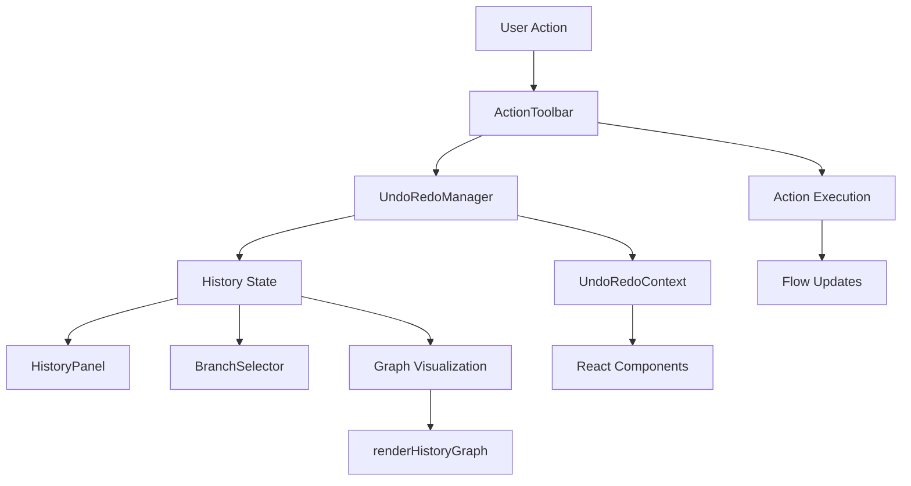

# Action Toolbar Infrastructure

The Action Toolbar is a sophisticated infrastructure component that provides centralized action management, undo/redo functionality, and history tracking for the Agenitix-2 flow editor. It features a comprehensive history system with branching support and visual graph representation.

## 🎯 Overview

The Action Toolbar serves as the command center for flow operations, providing:

- **Centralized Action Management**: All user actions routed through a single interface
- **Undo/Redo System**: Complete history tracking with visual feedback
- **Branch Management**: Support for multiple flow versions and branches
- **History Visualization**: Interactive graph showing action history
- **Real-time Collaboration**: Support for multi-user editing scenarios

## 🏗️ Architecture

### **Component Structure**

```
action-toolbar/
├── ActionToolbar.tsx           # Main toolbar component
├── history/                    # History management system
│   ├── UndoRedoManager.tsx    # Core undo/redo logic
│   ├── HistoryPanel.tsx       # History visualization panel
│   ├── BranchSelector.tsx     # Branch selection interface
│   ├── UndoRedoContext.tsx    # React context for history state
│   ├── graphHelpers.ts        # Graph manipulation utilities
│   ├── historyGraph.ts        # Graph data structures
│   └── renderHistoryGraph.tsx # Graph rendering component
└── hooks/                      # Custom React hooks
    └── useActionHistory.ts    # History management hook
```

### **Data Flow**



## 🔧 API Reference

### **Main Component**

```typescript
interface ActionToolbarProps {
  flow: Flow;                    // Current flow data
  onAction?: (action: Action) => void;  // Action callback
  onUndo?: () => void;          // Undo callback
  onRedo?: () => void;          // Redo callback
  onBranchChange?: (branch: string) => void;  // Branch change callback
  className?: string;            // CSS classes
}
```

### **History Management**

```typescript
// Action interface
interface Action {
  id: string;
  type: 'create' | 'update' | 'delete' | 'move' | 'connect';
  target: 'node' | 'edge' | 'flow';
  data: any;
  timestamp: number;
  userId?: string;
}

// History state
interface HistoryState {
  actions: Action[];
  currentIndex: number;
  branches: Branch[];
  currentBranch: string;
  canUndo: boolean;
  canRedo: boolean;
}

// Branch interface
interface Branch {
  id: string;
  name: string;
  parentBranch?: string;
  actions: Action[];
  createdAt: number;
  updatedAt: number;
}
```

### **Hook API**

```typescript
// History management hook
interface UseActionHistoryReturn {
  history: HistoryState;
  executeAction: (action: Action) => void;
  undo: () => void;
  redo: () => void;
  createBranch: (name: string) => void;
  switchBranch: (branchId: string) => void;
  mergeBranch: (sourceBranch: string, targetBranch: string) => void;
}
```

## 📋 Component Breakdown

### **ActionToolbar.tsx (Main Component)**

The primary toolbar that orchestrates all action management:

```typescript
export const ActionToolbar: React.FC<ActionToolbarProps> = ({
  flow,
  onAction,
  onUndo,
  onRedo,
  onBranchChange,
  className
}) => {
  // History management
  const { history, executeAction, undo, redo } = useActionHistory();
  
  // Action handlers
  const handleAction = useCallback((action: Action) => {
    executeAction(action);
    onAction?.(action);
  }, [executeAction, onAction]);
  
  return (
    <div className={cn('action-toolbar', className)}>
      <div className="toolbar-actions">
        <ActionButton onClick={undo} disabled={!history.canUndo}>
          <UndoIcon />
        </ActionButton>
        <ActionButton onClick={redo} disabled={!history.canRedo}>
          <RedoIcon />
        </ActionButton>
        <BranchSelector 
          branches={history.branches}
          currentBranch={history.currentBranch}
          onBranchChange={onBranchChange}
        />
      </div>
      <HistoryPanel history={history} />
    </div>
  );
};
```

**Key Features:**
- **Action Routing**: All actions go through centralized management
- **History Integration**: Seamless undo/redo functionality
- **Branch Support**: Multiple flow versions
- **Real-time Updates**: Live history visualization

### **UndoRedoManager.tsx**

Core logic for managing undo/redo operations:

```typescript
export class UndoRedoManager {
  private actions: Action[] = [];
  private currentIndex: number = -1;
  private maxHistorySize: number = 100;
  
  // Execute new action
  executeAction(action: Action): void {
    // Remove any actions after current index (for redo)
    this.actions = this.actions.slice(0, this.currentIndex + 1);
    
    // Add new action
    this.actions.push(action);
    this.currentIndex++;
    
    // Maintain history size
    if (this.actions.length > this.maxHistorySize) {
      this.actions.shift();
      this.currentIndex--;
    }
  }
  
  // Undo last action
  undo(): Action | null {
    if (this.currentIndex >= 0) {
      const action = this.actions[this.currentIndex];
      this.currentIndex--;
      return action;
    }
    return null;
  }
  
  // Redo next action
  redo(): Action | null {
    if (this.currentIndex < this.actions.length - 1) {
      this.currentIndex++;
      return this.actions[this.currentIndex];
    }
    return null;
  }
  
  // Get current state
  getState(): HistoryState {
    return {
      actions: [...this.actions],
      currentIndex: this.currentIndex,
      canUndo: this.currentIndex >= 0,
      canRedo: this.currentIndex < this.actions.length - 1
    };
  }
}
```

### **HistoryPanel.tsx**

Visual representation of action history:

```typescript
interface HistoryPanelProps {
  history: HistoryState;
  onActionSelect?: (action: Action) => void;
  onBranchSelect?: (branch: string) => void;
}
```

**Features:**
- **Timeline View**: Chronological action display
- **Graph Visualization**: Interactive history graph
- **Action Details**: Detailed information for each action
- **Filtering**: Filter actions by type, user, or time
- **Search**: Search through action history

### **BranchSelector.tsx**

Interface for managing flow branches:

```typescript
interface BranchSelectorProps {
  branches: Branch[];
  currentBranch: string;
  onBranchChange: (branchId: string) => void;
  onCreateBranch?: (name: string) => void;
  onMergeBranch?: (source: string, target: string) => void;
}
```

**Features:**
- **Branch List**: Display all available branches
- **Branch Creation**: Create new branches
- **Branch Merging**: Merge branches with conflict resolution
- **Branch Comparison**: Compare different branches
- **Branch Deletion**: Remove unused branches

### **renderHistoryGraph.tsx**

Interactive graph visualization of action history:

```typescript
interface HistoryGraphProps {
  actions: Action[];
  currentIndex: number;
  onNodeClick?: (action: Action) => void;
  onEdgeClick?: (fromAction: Action, toAction: Action) => void;
}
```

**Features:**
- **Force-directed Layout**: Automatic graph layout
- **Interactive Nodes**: Clickable action nodes
- **Edge Visualization**: Show action relationships
- **Zoom and Pan**: Navigate large graphs
- **Node Clustering**: Group related actions

## 🔄 State Management

### **UndoRedoContext.tsx**

React context for sharing history state:

```typescript
interface UndoRedoContextValue {
  history: HistoryState;
  executeAction: (action: Action) => void;
  undo: () => void;
  redo: () => void;
  createBranch: (name: string) => void;
  switchBranch: (branchId: string) => void;
}

export const UndoRedoContext = createContext<UndoRedoContextValue | null>(null);

export const UndoRedoProvider: React.FC<{ children: React.ReactNode }> = ({ 
  children 
}) => {
  const [history, setHistory] = useState<HistoryState>(initialHistory);
  const manager = useMemo(() => new UndoRedoManager(), []);
  
  const executeAction = useCallback((action: Action) => {
    manager.executeAction(action);
    setHistory(manager.getState());
  }, [manager]);
  
  const undo = useCallback(() => {
    const action = manager.undo();
    setHistory(manager.getState());
    return action;
  }, [manager]);
  
  const redo = useCallback(() => {
    const action = manager.redo();
    setHistory(manager.getState());
    return action;
  }, [manager]);
  
  return (
    <UndoRedoContext.Provider value={{
      history,
      executeAction,
      undo,
      redo
    }}>
      {children}
    </UndoRedoContext.Provider>
  );
};
```

## 🚀 Performance Optimizations

### **Action Batching**

Multiple actions can be batched for better performance:

```typescript
const batchActions = (actions: Action[]): void => {
  // Batch multiple actions into a single history entry
  const batchedAction: Action = {
    id: generateId(),
    type: 'batch',
    target: 'flow',
    data: { actions },
    timestamp: Date.now()
  };
  executeAction(batchedAction);
};
```

### **Lazy Loading**

History components are loaded on demand:

```typescript
const HistoryPanel = lazy(() => import('./HistoryPanel'));
const HistoryGraph = lazy(() => import('./renderHistoryGraph'));
```

### **Virtual Scrolling**

Large history lists use virtual scrolling:

```typescript
const VirtualizedHistoryList: React.FC<{ actions: Action[] }> = ({ 
  actions 
}) => {
  return (
    <FixedSizeList
      height={400}
      itemCount={actions.length}
      itemSize={60}
      itemData={actions}
    >
      {ActionItem}
    </FixedSizeList>
  );
};
```

## 🧪 Testing Strategy

### **Unit Tests**

```typescript
describe('UndoRedoManager', () => {
  it('executes actions correctly', () => {
    const manager = new UndoRedoManager();
    const action = createMockAction();
    
    manager.executeAction(action);
    const state = manager.getState();
    
    expect(state.actions).toHaveLength(1);
    expect(state.canUndo).toBe(true);
  });
  
  it('handles undo/redo correctly', () => {
    const manager = new UndoRedoManager();
    const action1 = createMockAction();
    const action2 = createMockAction();
    
    manager.executeAction(action1);
    manager.executeAction(action2);
    
    const undoneAction = manager.undo();
    expect(undoneAction).toEqual(action2);
    
    const redoneAction = manager.redo();
    expect(redoneAction).toEqual(action2);
  });
});
```

### **Integration Tests**

```typescript
describe('ActionToolbar Integration', () => {
  it('manages complete action workflow', () => {
    render(
      <UndoRedoProvider>
        <ActionToolbar flow={mockFlow} />
      </UndoRedoProvider>
    );
    
    // Test complete action workflow
    fireEvent.click(screen.getByLabelText('Create Node'));
    fireEvent.click(screen.getByLabelText('Undo'));
    fireEvent.click(screen.getByLabelText('Redo'));
  });
});
```

## 🔧 Configuration

### **Feature Flags**

```typescript
// featureFlags.ts
export const ACTION_TOOLBAR_FEATURES = {
  undoRedo: true,
  branching: true,
  historyGraph: true,
  realTimeCollaboration: true,
  actionBatching: true
};
```

### **Environment Variables**

```bash
# Action Toolbar Configuration
ACTION_TOOLBAR_MAX_HISTORY=100
ACTION_TOOLBAR_AUTO_SAVE=true
ACTION_TOOLBAR_BRANCHING_ENABLED=true
ACTION_TOOLBAR_COLLABORATION_ENABLED=false
```

## 📊 Telemetry Integration

The Action Toolbar integrates with the telemetry system:

```typescript
// Telemetry events
const actionToolbarEvents = {
  actionExecuted: (actionType: string, target: string) => {
    telemetry.track('action_toolbar_action_executed', { actionType, target });
  },
  undoPerformed: (actionType: string) => {
    telemetry.track('action_toolbar_undo_performed', { actionType });
  },
  redoPerformed: (actionType: string) => {
    telemetry.track('action_toolbar_redo_performed', { actionType });
  },
  branchCreated: (branchName: string) => {
    telemetry.track('action_toolbar_branch_created', { branchName });
  },
  branchSwitched: (branchId: string) => {
    telemetry.track('action_toolbar_branch_switched', { branchId });
  }
};
```

## 🔒 Security Considerations

### **Action Validation**

All actions are validated before execution:

```typescript
const validateAction = (action: Action): ValidationResult => {
  // Validate action structure
  if (!action.id || !action.type || !action.target) {
    return { valid: false, error: 'Invalid action structure' };
  }
  
  // Validate action permissions
  if (!hasPermission(action.type, action.target)) {
    return { valid: false, error: 'Insufficient permissions' };
  }
  
  return { valid: true };
};
```

### **Branch Security**

Branch operations are secured:

```typescript
const validateBranchOperation = (
  operation: 'create' | 'switch' | 'merge' | 'delete',
  branchId: string,
  user: User
): boolean => {
  // Check user permissions for branch operations
  return hasBranchPermission(operation, branchId, user);
};
```

## 🚀 Future Enhancements

### **Planned Features**

- **Real-time Collaboration**: Multi-user editing with conflict resolution
- **Advanced Branching**: Git-like branching with merge strategies
- **Action Templates**: Predefined action sequences
- **Custom Actions**: User-defined action types
- **Action Analytics**: Usage patterns and optimization suggestions

### **Performance Improvements**

- **Web Workers**: Background history processing
- **IndexedDB**: Local history storage
- **Service Workers**: Offline action queuing
- **WebAssembly**: Performance-critical operations

This Action Toolbar infrastructure provides a robust foundation for action management and history tracking in the Agenitix-2 platform. 