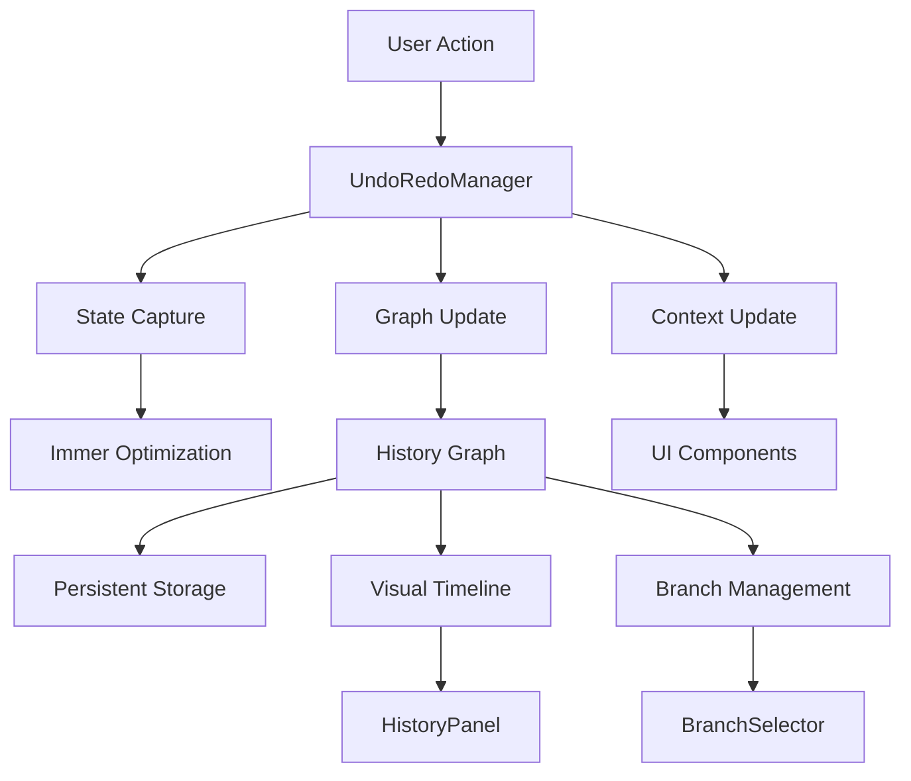

# History Infrastructure Component

**Route:** `documentation/infrastructure/history/README.md`
**HISTORY INFRASTRUCTURE - Graph-based undo/redo system for flow editor**

The History infrastructure component provides a sophisticated graph-based undo/redo system for the Agenitix-2 flow editor. It features multi-branch support, visual graph representation, and memory-optimized state management using Immer.js structural sharing.

## Table of Contents

- [Overview](#overview)
- [Architecture](#architecture)
- [API Reference](#api-reference)
- [Data Models](#data-models)
- [Integration Points](#integration-points)
- [Performance Considerations](#performance-considerations)
- [Testing Strategy](#testing-strategy)
- [Future Enhancements](#future-enhancements)

## Overview

The History component implements a graph-based undo/redo system that tracks user actions in the flow editor. Unlike traditional linear history, this system supports branching, allowing users to explore multiple action paths and maintain complex editing histories.

### Key Features

- **Graph-Based History**: Multi-branch support for complex editing scenarios
- **Memory Optimization**: 90% memory reduction using Immer.js structural sharing
- **Visual Graph Representation**: Interactive graph showing action history
- **Debounced Actions**: Prevents excessive history entries with intelligent debouncing
- **Branch Management**: Support for multiple flow versions and branches
- **Persistent Storage**: localStorage integration for session persistence
- **Performance Optimized**: Efficient state comparison and compression

## Architecture

### Component Structure

```
action-toolbar/history/
├── UndoRedoManager.tsx    # Core undo/redo logic with Immer optimization
├── HistoryPanel.tsx       # Visual history timeline with graph view
├── BranchSelector.tsx     # Branch selection interface
├── UndoRedoContext.tsx    # React context for history state management
├── graphHelpers.ts        # Graph manipulation utilities
├── historyGraph.ts        # Graph data structures and types
└── renderHistoryGraph.tsx # Graph visualization component
```

### Data Flow



## API Reference

### Core History API

```tsx
interface UndoRedoContextType {
  undo: () => boolean;
  redo: (childId?: string) => boolean;
  recordAction: (type: ActionType, metadata?: Record<string, unknown>) => void;
  recordActionDebounced: (type: ActionType, metadata?: Record<string, unknown>) => void;
  clearHistory: () => void;
  removeSelectedNode: (nodeId?: string) => boolean;
  getHistory: () => HistoryData;
  getFullGraph: () => HistoryGraph | null;
}

type ActionType = 
  | "node_add"
  | "node_delete" 
  | "node_move"
  | "edge_add"
  | "edge_delete"
  | "duplicate"
  | "bulk_update"
  | "paste";
```

### Graph Management API

```tsx
// Create root graph with initial state
export const createRootGraph = (initialState: FlowState): HistoryGraph;

// Create child node in graph
export const createChildNode = (
  graph: HistoryGraph,
  parentId: NodeId,
  label: string,
  before: FlowState,
  after: FlowState,
  metadata?: Record<string, unknown>
): NodeId;

// Get path from root to cursor
export const getPathToCursor = (graph: HistoryGraph): HistoryNode[];

// Save/load graph from localStorage
export const saveGraph = (graph: HistoryGraph): void;
export const loadGraph = (): HistoryGraph | null;

// Graph statistics and utilities
export const getGraphStats = (graph: HistoryGraph): GraphStats;
export const pruneGraphToLimit = (graph: HistoryGraph, maxSize: number): void;
```

### History Panel API

```tsx
interface HistoryPanelProps {
  className?: string;
}

// History data structure
interface HistoryData {
  entries: HistoryNode[];
  currentIndex: number;
  canUndo: boolean;
  canRedo: boolean;
  branchOptions?: string[];
  graphStats?: GraphStats;
  currentNode?: HistoryNode;
}
```

## Data Models

### History Graph Structure

```tsx
interface HistoryGraph {
  nodes: Record<NodeId, HistoryNode>;
  cursor: NodeId;  // Current position in the graph
  root: NodeId;    // Constant root node ID
}

interface HistoryNode {
  id: NodeId;
  parentId: NodeId | null;  // null for root
  childrenIds: NodeId[];    // Multiple branches supported
  label: string;            // Action description
  before: FlowState;        // State before action
  after: FlowState;         // State after action
  createdAt: number;
  metadata?: Record<string, unknown>;
}

interface FlowState {
  nodes: Node[];
  edges: Edge[];
  viewport?: { x: number; y: number; zoom: number };
  __hash?: string;  // Pre-computed structural hash for O(1) comparison
}
```

### Action Types

```tsx
type ActionType = 
  | "node_add"      // Add new node
  | "node_delete"   // Delete node
  | "node_move"     // Move node position
  | "edge_add"      // Add connection
  | "edge_delete"   // Remove connection
  | "duplicate"     // Duplicate nodes/edges
  | "bulk_update"   // Bulk operations
  | "paste";        // Paste operation
```

### Configuration Options

```tsx
interface UndoRedoConfig {
  maxHistorySize?: number;           // Default: 300
  positionDebounceMs?: number;       // Default: 0
  actionSeparatorMs?: number;        // Default: 200
  enableViewportTracking?: boolean;  // Default: false
  enableCompression?: boolean;       // Default: true
}
```

## Integration Points

### Flow Editor Integration

```tsx
// Integration with React Flow
import { useUndoRedo } from './UndoRedoContext';

const FlowEditor = () => {
  const { recordAction, undo, redo } = useUndoRedo();
  
  const handleNodeAdd = (node: Node) => {
    // Record action for undo/redo
    recordAction('node_add', { nodeId: node.id });
  };
  
  const handleNodeDelete = (nodeId: string) => {
    recordAction('node_delete', { nodeId });
  };
  
  return (
    <div>
      <button onClick={undo}>Undo</button>
      <button onClick={redo}>Redo</button>
      {/* Flow editor components */}
    </div>
  );
};
```

### History Panel Integration

```tsx
// Visual history timeline
const HistoryPanel = () => {
  const { getHistory, jumpToHistoryState } = useUndoRedo();
  const historyData = getHistory();
  
  return (
    <div className="history-panel">
      {historyData.entries.map((entry, index) => (
        <HistoryEntry 
          key={entry.id}
          entry={entry}
          isCurrent={index === historyData.currentIndex}
          onClick={() => jumpToHistoryState(entry.id)}
        />
      ))}
    </div>
  );
};
```

### Branch Management

```tsx
// Branch selection interface
const BranchSelector = () => {
  const { getBranchOptions, redo } = useUndoRedo();
  const branchOptions = getBranchOptions();
  
  return (
    <div className="branch-selector">
      {branchOptions.map(branchId => (
        <button 
          key={branchId}
          onClick={() => redo(branchId)}
        >
          Branch {branchId}
        </button>
      ))}
    </div>
  );
};
```

## Performance Considerations

### Memory Optimization

```tsx
// Immer.js structural sharing for 90% memory reduction
const createFlowStateOptimized = (
  nodes: Node[],
  edges: Edge[],
  viewport?: { x: number; y: number; zoom: number }
): FlowState => {
  return produce({} as FlowState, (draft) => {
    draft.nodes = nodes;
    draft.edges = edges;
    draft.viewport = viewport;
  });
};

// O(1) state comparison using pre-computed hashes
const areStatesEqualOptimized = (state1: FlowState, state2: FlowState): boolean => {
  if (state1.__hash && state2.__hash) {
    return state1.__hash === state2.__hash;
  }
  return JSON.stringify(state1) === JSON.stringify(state2);
};
```

### Debounced Actions

```tsx
// Prevent excessive history entries
const POSITION_DEBOUNCE_DELAY = 0;  // ms for position changes
const ACTION_SEPARATOR_DELAY = 200;  // ms between distinct actions

const recordActionDebounced = useCallback(
  (type: ActionType, metadata: Record<string, unknown> = {}) => {
    // Clear pending position actions
    if (positionDebounceRef.current) {
      clearTimeout(positionDebounceRef.current);
      positionDebounceRef.current = null;
    }
    
    recordAction(type, metadata);
  },
  [recordAction]
);
```

### Graph Compression

```tsx
// Lightweight compression for large graphs (≈70% smaller)
import { compressToUTF16, decompressFromUTF16 } from "lz-string";

const saveGraph = (graph: HistoryGraph): void => {
  const serialized = JSON.stringify(graph);
  const compressed = compressToUTF16(serialized);
  localStorage.setItem('history-graph', compressed);
};

const loadGraph = (): HistoryGraph | null => {
  const compressed = localStorage.getItem('history-graph');
  if (!compressed) return null;
  
  try {
    const serialized = decompressFromUTF16(compressed);
    return JSON.parse(serialized);
  } catch {
    return null;
  }
};
```

## Testing Strategy

### Unit Tests

```tsx
describe('UndoRedoManager', () => {
  beforeEach(() => {
    // Clear test data
    clearPersistedGraph();
  });
  
  it('should record action and support undo', () => {
    const manager = new UndoRedoManager();
    
    // Record action
    manager.recordAction('node_add', { nodeId: 'node-1' });
    
    // Verify can undo
    expect(manager.getHistory().canUndo).toBe(true);
    
    // Perform undo
    const result = manager.undo();
    expect(result).toBe(true);
    expect(manager.getHistory().canUndo).toBe(false);
  });
  
  it('should support branching', () => {
    const manager = new UndoRedoManager();
    
    // Create multiple actions
    manager.recordAction('node_add', { nodeId: 'node-1' });
    manager.recordAction('node_add', { nodeId: 'node-2' });
    
    // Undo to create branch point
    manager.undo();
    
    // Create new branch
    manager.recordAction('node_add', { nodeId: 'node-3' });
    
    const history = manager.getHistory();
    expect(history.branchOptions).toHaveLength(2);
  });
});
```

### Performance Tests

```tsx
describe('History Performance', () => {
  it('should handle large history efficiently', () => {
    const manager = new UndoRedoManager();
    const startTime = Date.now();
    
    // Create 1000 actions
    for (let i = 0; i < 1000; i++) {
      manager.recordAction('node_add', { nodeId: `node-${i}` });
    }
    
    const endTime = Date.now();
    expect(endTime - startTime).toBeLessThan(1000); // < 1 second
    
    // Verify memory usage is reasonable
    const graph = manager.getFullGraph();
    expect(Object.keys(graph?.nodes || {}).length).toBeLessThan(301); // Max 300 + root
  });
});
```

### Integration Tests

```tsx
describe('History Integration', () => {
  it('should integrate with React Flow', () => {
    const { result } = renderHook(() => useUndoRedo());
    
    // Simulate flow editor actions
    act(() => {
      result.current.recordAction('node_add', { nodeId: 'test-node' });
    });
    
    expect(result.current.getHistory().entries).toHaveLength(2); // root + action
  });
});
```

## Future Enhancements

### Planned Features

1. **Real-time Collaboration**: Multi-user editing with conflict resolution
2. **Advanced Branching**: Visual branch comparison and merging
3. **Cloud Synchronization**: Sync history across devices
4. **Export/Import**: Save and restore editing sessions
5. **Advanced Analytics**: Usage patterns and optimization suggestions

### Performance Enhancements

1. **Virtual Scrolling**: Handle very large histories efficiently
2. **Incremental Compression**: Compress history incrementally
3. **Background Processing**: Move heavy operations to Web Workers
4. **Smart Pruning**: Intelligent history cleanup based on usage patterns

### UI Improvements

1. **3D Graph Visualization**: Interactive 3D history graph
2. **Timeline View**: Chronological action timeline
3. **Search and Filter**: Find specific actions in history
4. **Keyboard Shortcuts**: Enhanced keyboard navigation

### Database Integration

1. **Convex Integration**: Persistent history storage
2. **Real-time Sync**: Live history updates across sessions
3. **Backup and Recovery**: Automated history backup
4. **Version Control**: Git-like version control for flows

---

**Keywords:** undo-redo, graph-history, multi-branch, memory-optimization, immer, structural-sharing, flow-editor, history-management 