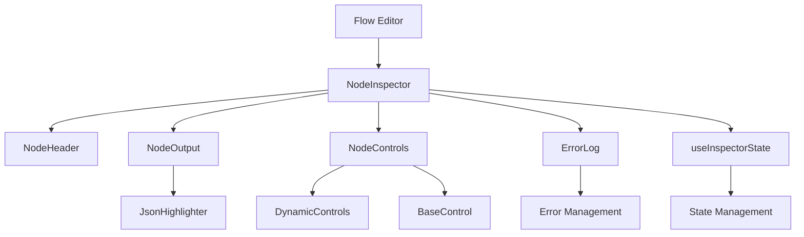

# Node Inspector Infrastructure

The Node Inspector is a sophisticated infrastructure component that provides the primary interface for inspecting and editing nodes in the Agenitix-2 flow editor. It features a modular architecture with dynamic controls, real-time validation, and comprehensive error handling.

## 🎯 Overview

The Node Inspector serves as the central hub for node interaction, providing:

- **Real-time Node Inspection**: View and edit node properties, data, and configuration
- **Dynamic Control System**: Context-aware controls that adapt to node types
- **Live Output Preview**: See computed results as you edit
- **Error Management**: Comprehensive error display and validation
- **Responsive Design**: Works across all screen sizes and devices

## 🏗️ Architecture

### **Component Structure**

```
node-inspector/
├── NodeInspector.tsx           # Main orchestrator component
├── index.ts                    # Clean exports and public API
├── types.ts                    # TypeScript definitions
├── constants.ts                # Configuration and constants
├── components/                 # UI components
│   ├── NodeHeader.tsx         # Node title and metadata display
│   ├── NodeOutput.tsx         # Output display with syntax highlighting
│   ├── NodeControls.tsx       # Control routing component
│   ├── DynamicControls.tsx    # Dynamic control generation
│   ├── EdgeInspector.tsx      # Edge/connection inspection
│   ├── ErrorLog.tsx           # Error display and management
│   ├── SizeControls.tsx       # Node sizing controls
│   ├── EnhancedNodeControls.tsx # Advanced node controls
│   └── EditableJsonEditor.tsx # JSON editing interface
├── controls/                   # Control implementations
│   └── BaseControl.tsx        # Reusable control primitives
├── hooks/                      # Custom React hooks
│   └── useInspectorState.ts   # State management hook
├── utils/                      # Utility functions
│   └── JsonHighlighter.tsx    # JSON syntax highlighting
├── services/                   # Business logic services
└── adapters/                   # Data adapters
```

### **Data Flow**



## 🔧 API Reference

### **Main Component**

```typescript
interface NodeInspectorProps {
  node: Node;                    // The node to inspect
  isLocked?: boolean;            // Whether inspector is locked
  onNodeUpdate?: (node: Node) => void;  // Update callback
  onNodeDelete?: (nodeId: string) => void;  // Delete callback
  className?: string;            // CSS classes
}
```

### **Core Types**

```typescript
// Node data structure
interface NodeData {
  id: string;
  type: string;
  position: { x: number; y: number };
  data: Record<string, any>;
  inputs?: NodeInput[];
  outputs?: NodeOutput[];
}

// Control configuration
interface ControlConfig {
  type: 'text' | 'number' | 'select' | 'toggle' | 'json';
  label: string;
  key: string;
  defaultValue?: any;
  validation?: ValidationRule[];
  options?: SelectOption[];
}

// Validation rules
interface ValidationRule {
  type: 'required' | 'min' | 'max' | 'pattern' | 'custom';
  value?: any;
  message?: string;
  validator?: (value: any) => boolean;
}
```

### **Hook API**

```typescript
// State management hook
interface UseInspectorStateReturn {
  nodeData: NodeData;
  isEditing: boolean;
  errors: ValidationError[];
  updateNodeData: (updates: Partial<NodeData>) => void;
  validateNode: () => ValidationError[];
  resetNode: () => void;
}
```

## 📋 Component Breakdown

### **NodeInspector.tsx (Main Orchestrator)**

The main component that orchestrates all inspector functionality:

```typescript
export const NodeInspector: React.FC<NodeInspectorProps> = ({
  node,
  isLocked = false,
  onNodeUpdate,
  onNodeDelete,
  className
}) => {
  // State management
  const { nodeData, updateNodeData, errors } = useInspectorState(node);
  
  // Layout management
  const [layout, setLayout] = useState<'vertical' | 'horizontal'>('vertical');
  
  // Error handling
  const handleError = useCallback((error: Error) => {
    // Error handling logic
  }, []);
  
  return (
    <div className={cn('node-inspector', className)}>
      <NodeHeader node={node} isLocked={isLocked} />
      <NodeOutput node={node} output={nodeData.outputs} />
      <NodeControls 
        node={node} 
        onUpdate={updateNodeData}
        isLocked={isLocked}
      />
      <ErrorLog errors={errors} onError={handleError} />
    </div>
  );
};
```

**Key Features:**
- **Responsive Layout**: Adapts to available space
- **Locked State**: Prevents editing when locked
- **Error Propagation**: Centralized error handling
- **Performance Optimized**: Memoized callbacks and components

### **NodeHeader.tsx**

Displays node metadata and provides basic actions:

```typescript
interface NodeHeaderProps {
  node: Node;
  isLocked?: boolean;
  onDelete?: (nodeId: string) => void;
  onDuplicate?: (nodeId: string) => void;
}
```

**Features:**
- **Node Type Display**: Shows node category and type
- **Node ID**: Displays unique identifier
- **Action Buttons**: Delete, duplicate, lock/unlock
- **Status Indicators**: Shows node state and health

### **NodeOutput.tsx**

Displays computed output with syntax highlighting:

```typescript
interface NodeOutputProps {
  node: Node;
  output: NodeOutput[];
  isExpanded?: boolean;
  onToggle?: () => void;
}
```

**Features:**
- **Syntax Highlighting**: JSON, JavaScript, and custom formats
- **Expandable Sections**: Collapsible output sections
- **Copy to Clipboard**: One-click output copying
- **Format Toggle**: Switch between formatted and raw views

### **DynamicControls.tsx**

Generates controls dynamically based on node schema:

```typescript
interface DynamicControlsProps {
  node: Node;
  schema: NodeSchema;
  onUpdate: (updates: Partial<NodeData>) => void;
  isLocked?: boolean;
}
```

**Features:**
- **Schema-driven**: Controls generated from node schema
- **Type Safety**: TypeScript validation for all inputs
- **Real-time Validation**: Immediate feedback on input errors
- **Custom Controls**: Support for node-specific control types

### **BaseControl.tsx**

Reusable control primitives for consistent UI:

```typescript
interface BaseControlProps {
  type: 'text' | 'number' | 'select' | 'toggle' | 'json';
  label: string;
  value: any;
  onChange: (value: any) => void;
  validation?: ValidationRule[];
  disabled?: boolean;
}
```

**Control Types:**
- **Text Input**: Single and multi-line text fields
- **Number Input**: Numeric inputs with min/max validation
- **Select Dropdown**: Single and multi-select options
- **Toggle Switch**: Boolean on/off controls
- **JSON Editor**: Structured JSON editing with validation

## 🎨 Theming Integration

The Node Inspector integrates with the theming system for consistent styling:

```typescript
// Theme-aware styling
const inspectorTheme = {
  header: {
    background: 'var(--inspector-header-bg)',
    border: 'var(--inspector-header-border)',
    text: 'var(--inspector-header-text)'
  },
  controls: {
    background: 'var(--inspector-controls-bg)',
    border: 'var(--inspector-controls-border)',
    focus: 'var(--inspector-controls-focus)'
  },
  output: {
    background: 'var(--inspector-output-bg)',
    syntax: 'var(--inspector-syntax-highlight)'
  }
};
```

## 🔄 State Management

### **useInspectorState Hook**

Centralized state management for inspector functionality:

```typescript
export const useInspectorState = (node: Node) => {
  // Node data state
  const [nodeData, setNodeData] = useState<NodeData>(node.data);
  
  // Editing state
  const [isEditing, setIsEditing] = useState(false);
  
  // Validation state
  const [errors, setErrors] = useState<ValidationError[]>([]);
  
  // Update handler
  const updateNodeData = useCallback((updates: Partial<NodeData>) => {
    setNodeData(prev => ({ ...prev, ...updates }));
    validateNode({ ...nodeData, ...updates });
  }, [nodeData]);
  
  // Validation
  const validateNode = useCallback((data: NodeData) => {
    const validationErrors = validateNodeSchema(data);
    setErrors(validationErrors);
    return validationErrors;
  }, []);
  
  return {
    nodeData,
    isEditing,
    errors,
    updateNodeData,
    validateNode,
    setIsEditing
  };
};
```

## 🚀 Performance Optimizations

### **React.memo Usage**

Components are memoized to prevent unnecessary re-renders:

```typescript
export const NodeHeader = React.memo<NodeHeaderProps>(({
  node,
  isLocked,
  onDelete,
  onDuplicate
}) => {
  // Component implementation
});
```

### **useCallback Optimization**

Event handlers are memoized for stable references:

```typescript
const handleUpdate = useCallback((updates: Partial<NodeData>) => {
  updateNodeData(updates);
  onNodeUpdate?.(updatedNode);
}, [updateNodeData, onNodeUpdate]);
```

### **Lazy Loading**

Heavy components are loaded on demand:

```typescript
const JsonEditor = lazy(() => import('./EditableJsonEditor'));
const DynamicControls = lazy(() => import('./DynamicControls'));
```

## 🧪 Testing Strategy

### **Unit Tests**

```typescript
// Component testing
describe('NodeInspector', () => {
  it('renders node information correctly', () => {
    render(<NodeInspector node={mockNode} />);
    expect(screen.getByText(mockNode.type)).toBeInTheDocument();
  });
  
  it('handles node updates', () => {
    const onUpdate = jest.fn();
    render(<NodeInspector node={mockNode} onNodeUpdate={onUpdate} />);
    // Test update functionality
  });
});
```

### **Integration Tests**

```typescript
// Integration testing
describe('NodeInspector Integration', () => {
  it('updates node data and validates', async () => {
    render(<NodeInspector node={mockNode} />);
    // Test full update flow
  });
});
```

### **E2E Tests**

```typescript
// End-to-end testing
describe('NodeInspector E2E', () => {
  it('allows complete node editing workflow', () => {
    // Test complete user workflow
  });
});
```

## 🔧 Configuration

### **Feature Flags**

```typescript
// featureFlags.ts
export const NODE_INSPECTOR_FEATURES = {
  dynamicControls: true,
  realTimeValidation: true,
  syntaxHighlighting: true,
  errorReporting: true,
  theming: true
};
```

### **Environment Variables**

```bash
# Node Inspector Configuration
NODE_INSPECTOR_MAX_HEIGHT=600px
NODE_INSPECTOR_AUTO_SAVE=true
NODE_INSPECTOR_VALIDATION_DELAY=300ms
NODE_INSPECTOR_THEME=auto
```

## 📊 Telemetry Integration

The Node Inspector integrates with the telemetry system:

```typescript
// Telemetry events
const inspectorEvents = {
  nodeInspected: (nodeType: string, nodeId: string) => {
    telemetry.track('node_inspector_opened', { nodeType, nodeId });
  },
  nodeUpdated: (nodeType: string, changes: string[]) => {
    telemetry.track('node_inspector_updated', { nodeType, changes });
  },
  validationError: (errorType: string, nodeType: string) => {
    telemetry.track('node_inspector_validation_error', { errorType, nodeType });
  }
};
```

## 🔒 Security Considerations

### **Input Validation**

All user inputs are validated before processing:

```typescript
const validateInput = (input: any, schema: ValidationSchema) => {
  // Comprehensive validation
  const errors = validateSchema(input, schema);
  return errors;
};
```

### **XSS Prevention**

Output is sanitized to prevent XSS attacks:

```typescript
const sanitizeOutput = (output: string) => {
  return DOMPurify.sanitize(output);
};
```

## 🚀 Future Enhancements

### **Planned Features**

- **Real-time Collaboration**: Multi-user editing support
- **Advanced Validation**: Custom validation rules and schemas
- **Plugin System**: Third-party control extensions
- **Mobile Optimization**: Touch-friendly controls
- **Accessibility Improvements**: Enhanced screen reader support

### **Performance Improvements**

- **Virtual Scrolling**: For large output displays
- **Web Workers**: For heavy validation tasks
- **Service Workers**: For offline functionality
- **WebAssembly**: For performance-critical operations

This Node Inspector infrastructure provides a robust, extensible foundation for node interaction in the Agenitix-2 platform. 