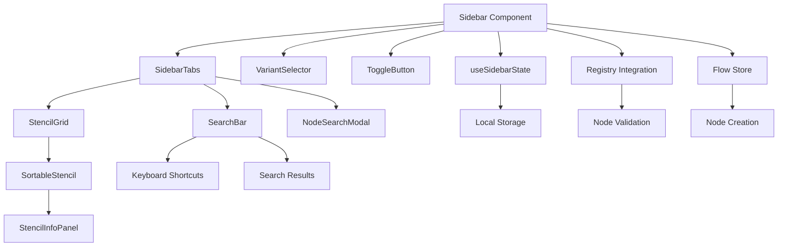

# Sidebar Infrastructure Component

**Route:** `documentation/infrastructure/sidebar/README.md`
**SIDEBAR INFRASTRUCTURE - Enhanced node creation and management panel with registry integration**

The Sidebar component provides a comprehensive node creation and management interface with advanced features including registry integration, tabbed organization, drag-and-drop functionality, search capabilities, and extensive keyboard shortcuts.

## Table of Contents

- [Overview](#overview)
- [Architecture](#architecture)
- [Components](#components)
- [Search Functionality](#search-functionality)
- [Keyboard Shortcuts](#keyboard-shortcuts)
- [API Reference](#api-reference)
- [State Management](#state-management)
- [Registry Integration](#registry-integration)
- [Performance Optimizations](#performance-optimizations)
- [Testing Strategy](#testing-strategy)
- [Configuration](#configuration)
- [Security](#security)
- [Future Enhancements](#future-enhancements)

## Overview

The Sidebar infrastructure component serves as the primary interface for node creation and management in the flow editor. It provides a tabbed interface organizing nodes by category, supports drag-and-drop node creation, integrates with the node registry for validation and metadata, and includes comprehensive search functionality with keyboard shortcuts.

### Key Features

- **Registry Integration**: Validates node types against the node registry
- **Tabbed Interface**: Organizes nodes by category with search functionality
- **Advanced Search**: Real-time search with fuzzy matching and keyboard navigation
- **Comprehensive Keyboard Shortcuts**: QWERTY grid shortcuts, variant switching, tab navigation
- **Drag-and-Drop**: Native HTML5 drag-and-drop for node creation
- **Custom Node Management**: Add, remove, and reorder custom nodes
- **Variant System**: Multiple sidebar configurations (A, B, C, D, E)
- **Performance Optimized**: React.memo, useCallback, and useMemo optimizations
- **Type Safety**: Comprehensive TypeScript interfaces and validation

## Architecture

### Component Structure

```
sidebar/
├── README.md                 # This documentation
├── index.ts                  # Main exports
├── types.ts                  # TypeScript type definitions
├── constants.ts              # Configuration and registry integration
├── Sidebar.tsx              # Main sidebar component
├── SidebarTabs.tsx          # Tabbed interface component
├── SidebarVariantSelector.tsx # Variant selector component
├── ToggleButton.tsx         # Show/hide toggle button
├── StencilGrid.tsx          # Grid of draggable stencils
├── SortableStencil.tsx      # Individual stencil item
├── StencilInfoPanel.tsx     # Stencil information panel
├── components/              # Sub-components
│   ├── NodeSearchModal.tsx  # Node search modal
│   ├── SearchBar.tsx        # Search functionality with keyboard shortcuts
│   └── SidebarTabContent.tsx # Tab content component
├── hooks/                   # Custom hooks
│   ├── useSidebarState.ts   # Sidebar state management
│   ├── useStencilStorage.ts # LocalStorage persistence
│   └── useDragSensors.ts    # Drag and drop configuration
└── utils/                   # Utility functions
    └── debugUtils.ts        # Development debugging utilities
```

### Data Flow



## Components

### Main Sidebar Component

The primary sidebar component that orchestrates all functionality:

```tsx
interface SidebarProps {
  className?: string;
  enableDebug?: boolean;
  onNodeCreated?: (nodeType: NodeType, nodeId: string) => void;
  onCreationError?: (error: string, nodeType?: string) => void;
}

export interface SidebarRef {
  toggle: () => void;
  refreshFromRegistry: () => void;
  getRegistryStats: () => RegistryStats;
  validateConfiguration: () => ValidationResult;
  createNodeAt: (nodeType: string, position: { x: number; y: number }) => boolean;
}
```

**Key Features:**
- Registry integration for node validation
- Debug mode for development
- Custom node creation handlers
- Error handling for failed operations
- Ref-based API for external control

### SidebarTabs Component

Manages the tabbed interface and node organization:

```tsx
interface SidebarTabsProps {
  variant: SidebarVariant;
  activeTab: string;
  onTabChange: (tab: string) => void;
  onDoubleClickCreate: (nodeType: string) => void;
  isHidden: boolean;
  customNodes: NodeStencil[];
  onAddCustomNode: (node: NodeStencil) => void;
  onRemoveCustomNode: (nodeId: string) => void;
  onReorderCustomNodes: (newOrder: NodeStencil[]) => void;
  onVariantChange: (variant: SidebarVariant) => void;
  onToggle: () => void;
}
```

**Features:**
- Tab-based node organization
- Search functionality with modal
- Keyboard shortcuts for navigation
- Drag-and-drop node creation
- Custom node management

### SortableStencil Component

Individual draggable node stencil:

```tsx
interface SortableStencilProps {
  stencil: NodeStencil;
  onDoubleClick: (nodeType: string) => void;
  onHover: (stencil: NodeStencil | null) => void;
  isCustom?: boolean;
  onRemove?: (nodeId: string) => void;
}
```

**Features:**
- HTML5 drag-and-drop
- Double-click node creation
- Hover information display
- Custom node removal
- Visual feedback for interactions

## Search Functionality

### SearchBar Component

Advanced search interface with comprehensive keyboard shortcuts:

```tsx
interface SearchBarProps {
  onNativeDragStart: (e: React.DragEvent<HTMLDivElement>, nodeType: string) => void;
  onDoubleClickCreate: (nodeType: string) => void;
  setHovered: (s: HoveredStencil | null) => void;
  isVisible: boolean;
  onClose: () => void;
}
```

**Search Features:**
- Real-time filtering with fuzzy matching
- Keyboard shortcuts for node creation (QWERTY grid)
- Enhanced text editing shortcuts (Alt+Q for backspace)
- Search result navigation
- Clear button and search icon
- Responsive design with proper focus states

### NodeSearchModal Component

Modal-based node discovery interface:

```tsx
interface NodeSearchModalProps {
  isOpen: boolean;
  onClose: () => void;
  onSelectNode?: (nodeType: NodeType) => void;
  onAddNode?: (node: any) => void;
  availableNodes?: NodeType[];
  existingNodes?: string[];
}
```

**Modal Features:**
- Fuzzy search with real-time filtering and scoring
- Keyboard navigation with arrow keys and shortcuts
- Visual feedback with hover states and selection indicators
- Registry integration for rich node metadata display
- Responsive design with proper accessibility features

## Keyboard Shortcuts

### Comprehensive Shortcut System

The sidebar implements an extensive keyboard shortcut system:

#### Tab Navigation Shortcuts
- **1-5**: Switch between tabs (1-5 for tabs, 6 for search)
- **Alt+1-5**: Switch between sidebar variants (A, B, C, D, E)

#### Search Shortcuts
- **6**: Open search interface
- **Escape**: Close search
- **Alt+C**: Close search
- **Enter**: Exit search input (when typing)
- **Alt+Q**: Enhanced backspace when typing
- **Alt+Shift+Q**: Delete entire word
- **Alt+Ctrl+Q**: Delete from cursor to beginning of line
- **Alt+W**: Enter key when typing

#### QWERTY Grid Shortcuts (Node Creation)
When not typing in input fields:

**Regular Tabs:**
- **Q, W, E, R, T**: Row 1 positions (0-4)
- **A, S, D, F, G**: Row 2 positions (5-9)
- **Z, X, C, V, B**: Row 3 positions (10-14)

**Custom Tab (Variant E):**
- **Q**: Add new custom node
- **W, E, R, T**: Row 1 positions (0-3)
- **A, S, D, F, G**: Row 2 positions (4-8)
- **Z, X, C, V, B**: Row 3 positions (9-13)

#### Key Repeat Prevention
- **150ms cooldown** between same key presses
- **Browser key repeat prevention** for node creation keys
- **Alt+Q bypass** for fast text deletion

### Shortcut Implementation

```tsx
// Keyboard shortcut mapping for QWERTY grid
const getKeyboardShortcut = (index: number): string => {
  const gridKeyMap: Record<number, string> = {
    // Row 1: qwert (positions 0-4)
    0: "Q", 1: "W", 2: "E", 3: "R", 4: "T",
    // Row 2: asdfg (positions 5-9)
    5: "A", 6: "S", 7: "D", 8: "F", 9: "G",
    // Row 3: zxcvb (positions 10-14)
    10: "Z", 11: "X", 12: "C", 13: "V", 14: "B",
  };
  return gridKeyMap[index] || "";
};
```

## API Reference

### Sidebar Component API

#### Props

| Prop | Type | Description |
|------|------|-------------|
| `className` | `string` | CSS classes for styling |
| `enableDebug` | `boolean` | Enable debug mode for development |
| `onNodeCreated` | `function` | Callback when node is created |
| `onCreationError` | `function` | Callback for creation errors |

#### Ref Methods

| Method | Parameters | Returns | Description |
|--------|------------|---------|-------------|
| `toggle` | - | `void` | Toggle sidebar visibility |
| `refreshFromRegistry` | - | `void` | Refresh node data from registry |
| `getRegistryStats` | - | `RegistryStats` | Get registry statistics |
| `validateConfiguration` | - | `ValidationResult` | Validate current configuration |
| `createNodeAt` | `nodeType, position` | `boolean` | Create node at specific position |

### Node Stencil Interface

```tsx
interface NodeStencil {
  id: string;
  nodeType: string;
  label: string;
  description?: string;
  category: string;
  icon?: string;
  metadata?: Record<string, any>;
}
```

## State Management

### useSidebarState Hook

Manages sidebar state with persistence:

```tsx
interface SidebarState {
  variant: SidebarVariant;
  activeTab: string;
  customNodes: NodeStencil[];
  isHidden: boolean;
}

const {
  variant,
  activeTab,
  customNodes,
  isHidden,
  setVariant,
  setActiveTab,
  addCustomNode,
  removeCustomNode,
  reorderCustomNodes,
  toggleVisibility
} = useSidebarState();
```

### State Persistence

- **Local Storage**: Custom nodes and preferences persist across sessions
- **Registry Cache**: Node metadata cached for performance
- **Session State**: Current tab and variant maintained during session

## Registry Integration

### Node Validation

```tsx
const validateNode = (nodeType: string) => ({
  isValid: hasNodeSpec(nodeType),
  warnings: hasNodeSpec(nodeType) ? [] : [`Node type '${nodeType}' not found in registry`],
  suggestions: hasNodeSpec(nodeType) ? [] : ["Check available node types in the registry"],
});
```

### Registry Statistics

```tsx
interface RegistryStats {
  totalNodes: number;
  validNodes: number;
  invalidNodes: number;
  categories: Record<string, number>;
  lastUpdated: number;
}
```

### Registry Operations

- **Node Validation**: Check if node type exists in registry
- **Metadata Retrieval**: Get node metadata for display
- **Category Organization**: Organize nodes by registry categories
- **Performance Caching**: Cache registry data for faster access

## Performance Optimizations

### React Optimizations

1. **React.memo**: Prevent unnecessary re-renders of expensive components
2. **useCallback**: Stable function references for event handlers
3. **useMemo**: Computed values cached for performance
4. **useRef**: Stable references for DOM elements and values

### Rendering Optimizations

```tsx
// Memoized stencil grid
const StencilGrid = React.memo(({ stencils, onDoubleClick }) => {
  return (
    <div className="grid grid-cols-2 gap-2">
      {stencils.map(stencil => (
        <SortableStencil
          key={stencil.id}
          stencil={stencil}
          onDoubleClick={onDoubleClick}
        />
      ))}
    </div>
  );
});
```

### Memory Management

- **Lazy Loading**: Load stencils on demand
- **Virtual Scrolling**: For large stencil lists
- **Event Cleanup**: Proper cleanup of event listeners
- **Registry Caching**: Intelligent caching of registry data

## Testing Strategy

### Unit Tests

```tsx
describe('Sidebar Component', () => {
  it('should render with default props', () => {
    render(<Sidebar />);
    expect(screen.getByRole('complementary')).toBeInTheDocument();
  });

  it('should handle node creation', () => {
    const onNodeCreated = jest.fn();
    render(<Sidebar onNodeCreated={onNodeCreated} />);
    // Test node creation flow
  });
});
```

### Integration Tests

```tsx
describe('Sidebar Integration', () => {
  it('should integrate with flow store', () => {
    // Test flow store integration
  });

  it('should work with registry', () => {
    // Test registry integration
  });
});
```

### E2E Tests

```tsx
describe('Sidebar E2E', () => {
  it('should create nodes via drag and drop', () => {
    // Test drag and drop functionality
  });

  it('should manage custom nodes', () => {
    // Test custom node management
  });
});
```

## Configuration

### Variant Configuration

```tsx
const VARIANT_CONFIG: Record<SidebarVariant, VariantConfig> = {
  A: {
    tabs: [
      { id: 'MAIN', label: 'Main' },
      { id: 'ADVANCED', label: 'Advanced' },
      { id: 'IO', label: 'I/O' }
    ],
    defaultTab: 'MAIN'
  },
  B: {
    tabs: [
      { id: 'CREATE', label: 'Create' },
      { id: 'VIEW', label: 'View' },
      { id: 'TRIGGER', label: 'Trigger' },
      { id: 'TEST', label: 'Test' }
    ],
    defaultTab: 'CREATE'
  },
  // ... other variants
};
```

### Constants

```tsx
// Drag and drop configuration
const DRAG_CONFIG = {
  KEY_REPEAT_COOLDOWN: 150,
  DRAG_THRESHOLD: 5,
  DROP_ZONE_CLASS: 'drop-zone'
};

// Search configuration
const SEARCH_CONFIG = {
  DEBOUNCE_DELAY: 300,
  MIN_SEARCH_LENGTH: 2,
  MAX_RESULTS: 50
};

// Keyboard shortcuts configuration
const KEYBOARD_CONFIG = {
  KEY_REPEAT_COOLDOWN: 150,
  NODE_CREATION_KEYS: ['q', 'w', 'e', 'r', 't', 'a', 's', 'd', 'f', 'g', 'z', 'x', 'c', 'v', 'b']
};
```

## Security

### Input Validation

- **Node Type Validation**: Validate against registry before creation
- **Sanitization**: Sanitize user inputs for search and custom nodes
- **XSS Prevention**: Proper escaping of user-generated content

### Access Control

- **Registry Permissions**: Check registry access permissions
- **Custom Node Limits**: Limit number of custom nodes
- **Rate Limiting**: Prevent rapid node creation

### Error Handling

```tsx
const handleNodeCreation = useCallback((nodeType: string) => {
  try {
    if (!hasNodeSpec(nodeType)) {
      throw new Error(`Invalid node type: ${nodeType}`);
    }
    
    const nodeId = generateNodeId();
    const node = createNode(nodeType, nodeId);
    
    onNodeCreated?.(nodeType, nodeId);
  } catch (error) {
    onCreationError?.(error.message, nodeType);
  }
}, [onNodeCreated, onCreationError]);
```

## Future Enhancements

### Planned Features

1. **Advanced Search**: Enhanced fuzzy search with node metadata
2. **Node Previews**: Visual previews of node functionality
3. **Custom Categories**: User-defined node categories
4. **Import/Export**: Share custom node configurations
5. **Enhanced Keyboard Shortcuts**: More sophisticated shortcut system

### Performance Improvements

1. **Virtual Scrolling**: For large stencil lists
2. **Lazy Loading**: Load stencils on demand
3. **Web Workers**: Offload registry operations
4. **Service Workers**: Cache registry data

### Integration Enhancements

1. **Plugin System**: Third-party node plugins
2. **Theme Integration**: Better theming system integration
3. **Accessibility**: Enhanced accessibility features
4. **Internationalization**: Multi-language support

---

**Keywords:** sidebar-infrastructure, node-creation, registry-integration, drag-drop, tabbed-interface, search-functionality, keyboard-shortcuts, performance-optimization, type-safety 