# Node Creation & Build Process

**Comprehensive guide to AgenitiX's automated node creation and build system**

---

## 🎯 Quick Overview

AgenitiX features a fully automated node creation system that takes you from idea to working node in **30 seconds** with zero configuration required.

### Key Benefits

- ✅ **30-second workflow** - From command to working node
- ✅ **Zero configuration** - Everything automated via Plop
- ✅ **Enterprise-grade** - Built-in validation, theming, and type safety
- ✅ **Single source of truth** - NodeSpec drives everything
- ✅ **Immediate availability** - No build step required

---

## 🚀 30-Second Workflow

```mermaid
flowchart TD
    Start([🚀 pnpm new:node]) --> Prompts[📝 Interactive Setup<br/>30 seconds]

    Prompts --> Generate[🔧 Plop Auto-Generation]

    Generate --> Files{📁 Files Created}

    Files --> NodeFile["{kind}.node.tsx<br/>Complete node definition"]
    Files --> Registry["Registry Updates<br/>Auto-imports & exports"]
    Files --> Theme["Theming Integration<br/>Category-based styling"]

    NodeFile --> Ready[✅ Ready to Use]
    Registry --> Ready
    Theme --> Ready

    Ready --> Sidebar["🎯 Sidebar<br/>Drag & drop stencils"]
    Ready --> Inspector["🔍 Inspector<br/>Auto-generated controls"]
    Ready --> Canvas["⚛️ Canvas<br/>Full React Flow integration"]

    classDef startNode fill:#2196F3,stroke:#1976D2,stroke-width:3px,color:#fff
    classDef processNode fill:#4CAF50,stroke:#388E3C,stroke-width:2px,color:#fff
    classDef fileNode fill:#FF9800,stroke:#F57C00,stroke-width:2px,color:#fff
    classDef readyNode fill:#8BC34A,stroke:#689F38,stroke-width:3px,color:#fff
    classDef endNode fill:#9C27B0,stroke:#7B1FA2,stroke-width:2px,color:#fff

    class Start startNode
    class Prompts,Generate processNode
    class Files,NodeFile,Registry,Theme fileNode
    class Ready readyNode
    class Sidebar,Inspector,Canvas endNode
```



---

## 📋 Step-by-Step Process

### 1. **Start Node Creation**

```bash
pnpm new:node
```

### 2. **Interactive Prompts** (30 seconds)

The system will ask you to configure:

- **Node Kind**: Unique identifier (e.g., `createText`, `viewCsv`)
- **Domain**: Functional category (`create`, `view`, `trigger`, `test`, `cycle`)
- **Category**: UI category (`CREATE`, `VIEW`, `TRIGGER`, `TEST`, `CYCLE`)
- **Collapsed Size**: Standard dimensions (`C1`, `C1W`, `C2`, `C3`)
- **Expanded Size**: Extended dimensions (`FE0`, `FE1`, `FE2`, `VE1`, etc.)
- **TypeScript Symbol**: Optional output handle symbol

### 3. **Automatic Generation**

Plop automatically:

- ✅ Creates the complete node file
- ✅ Updates all registry files
- ✅ Adds imports and exports
- ✅ Integrates with theming system
- ✅ Makes node immediately available

---

## 🏗️ Complete Architecture Flow

```mermaid
graph TD
    A["🚀 Developer runs<br/>pnpm new:node"] --> B["📝 Interactive Prompts<br/>• Node kind (createText)<br/>• Domain (create/view/trigger)<br/>• Category (CREATE/VIEW/etc)<br/>• Sizes (collapsed/expanded)"]

    B --> C["🔧 Plop Generator<br/>Processes Template"]

    C --> D["📁 Creates Node File<br/>node-domain/{domain}/{kind}.node.tsx"]

    C --> E["🔄 Auto-Updates Registry Files"]

    E --> F["📋 useDynamicNodeTypes.ts<br/>• Adds import<br/>• Adds to nodeTypes object"]
    E --> G["🗂️ nodespec-registry.ts<br/>• Adds import + spec<br/>• Adds to nodeSpecs object"]
    E --> H["📤 node-domain/index.ts<br/>• Adds export statement"]

    D --> I["🏗️ Node Architecture<br/>Single .node.tsx file contains:<br/>• Zod Schema (validation)<br/>• NodeSpec (metadata)<br/>• React Component (UI)<br/>• withNodeScaffold wrapper"]

    F --> J["⚛️ React Flow Integration<br/>nodeTypes available to<br/>ReactFlow component"]

    G --> K["📊 Registry System<br/>Provides metadata for:<br/>• Sidebar stencils<br/>• Node Inspector<br/>• Theming system"]

    K --> L["🎨 Sidebar Auto-Generation<br/>• Creates stencils by category<br/>• Organizes in tabs<br/>• Provides drag-drop UI"]

    K --> M["🔍 Node Inspector<br/>• Schema-driven controls<br/>• Auto-generated from Zod<br/>• Bidirectional data sync"]

    K --> N["🎨 Theming System<br/>• Category-based colors<br/>• Semantic tokens<br/>• Light/dark mode"]

    J --> O["🎯 Canvas Integration<br/>Nodes immediately available:<br/>• Drag from sidebar<br/>• Double-click creation<br/>• Full React Flow features"]

    L --> O
    M --> O
    N --> O

    O --> P["✅ Zero Configuration<br/>Node ready to use:<br/>• No build step needed<br/>• Automatic registration<br/>• Enterprise validation"]
```



---

## 📁 File Structure & Organization

### Node File Structure

```
features/business-logic-modern/node-domain/
├── create/
│   └── {kind}.node.tsx          # Complete node definition
├── view/
│   └── {kind}.node.tsx
├── trigger/
│   └── {kind}.node.tsx
└── index.ts                     # Auto-updated exports
```

### Registry Files (Auto-Updated)

```
infrastructure/
├── flow-engine/hooks/
│   └── useDynamicNodeTypes.ts   # React Flow integration
├── node-registry/
│   └── nodespec-registry.ts     # Metadata registry
└── sidebar/
    └── constants.ts             # Auto-generated stencils
```

---

## 🏗️ Single File Architecture

Each node is completely self-contained in one `.node.tsx` file:

```typescript
/**
 * NODE ARCHITECTURE - Everything in one file
 */

// 1. ZOD SCHEMA - Data validation & type safety
const NodeDataSchema = z.object({
  text: SafeSchemas.text('Default text'),
  isEnabled: SafeSchemas.boolean(true),
  isExpanded: SafeSchemas.boolean(false), // Proper state management
  // ... other fields
}).passthrough();

// 2. NODE SPEC - Single source of truth for metadata
const spec: NodeSpec = {
  kind: 'myNode',
  displayName: 'My Node',
  category: CATEGORIES.CREATE,
  size: {
    expanded: EXPANDED_SIZES.FE1,
    collapsed: COLLAPSED_SIZES.C1,
  },
  handles: [/* ... */],
  inspector: { key: 'MyNodeInspector' },
  initialData: createSafeInitialData(NodeDataSchema),
  dataSchema: NodeDataSchema,
};

// 3. REACT COMPONENT - UI implementation
const NodeComponent = ({ data, id }: NodeProps) => {
  // Proper state management with useNodeData hook
  const { nodeData, updateNodeData } = useNodeData(id, data);

  // Enterprise validation
  const validationResult = validateNodeData(nodeData);

  // Component implementation...
  return (
    <>
      <ExpandCollapseButton
        showUI={nodeData.isExpanded}
        onToggle={() => updateNodeData({
          ...nodeData,
          isExpanded: !nodeData.isExpanded
        })}
      />
      {/* Node content */}
    </>
  );
};

// 4. EXPORT - HOC wrapper + spec for registry
export default withNodeScaffold(spec, NodeComponent);
export { spec };
```

---

## 🔄 Registry System

### Zero-Maintenance Registry

The registry system is completely automated:

- **NodeSpec as Single Source**: All metadata comes from NodeSpec
- **Auto-Updates**: Plop handles all imports/exports
- **No Duplication**: Never manually update registry files
- **Type Safety**: Full TypeScript integration

### Registry Functions

```typescript
// Get node metadata
const metadata = getNodeSpecMetadata("createText");

// Get nodes by category
const createNodes = getNodesByCategory("CREATE");

// Validate node exists
const isValid = hasNodeSpec("myNode");
```

---

## 🎨 Theming Integration

### Category-Based Theming

Nodes automatically get themed based on their category:

- **CREATE**: Green theme for creation nodes
- **VIEW**: Blue theme for display nodes
- **TRIGGER**: Orange theme for event nodes
- **TEST**: Red theme for testing nodes
- **CYCLE**: Purple theme for workflow nodes

### Semantic Tokens

All styling uses semantic tokens for consistency:

```css
--node-create-bg: hsl(var(--create-bg));
--node-create-border: hsl(var(--create-border));
--node-create-text: hsl(var(--create-text));
```

---

## 🔍 Node Inspector Integration

### Schema-Driven Controls

Controls are automatically generated from your Zod schema:

```typescript
const NodeDataSchema = z.object({
  title: SafeSchemas.text("Default title"), // → Text input
  count: SafeSchemas.number(1, 1, 100), // → Number input with range
  enabled: SafeSchemas.boolean(true), // → Toggle switch
  priority: SafeSchemas.enum(["low", "medium", "high"], "medium"), // → Select dropdown
});
```

### Bidirectional Sync

Inspector controls automatically sync with node components using the proper [isExpanded state management pattern](memory:8714291522141776208).

---

## 🎯 Sidebar Integration

### Auto-Generated Stencils

Sidebar stencils are automatically created from NodeSpec metadata:

- **Category Organization**: Nodes grouped by functional category
- **Drag & Drop**: Native React Flow integration
- **Keyboard Shortcuts**: Auto-assigned shortcuts (Q, W, E, R, etc.)
- **Search**: Real-time node filtering
- **Custom Tabs**: User-configurable node collections

---

## ✅ Enterprise Features

### Built-In Validation

- **Zod Schema**: Type-safe data validation
- **Error Reporting**: Comprehensive error tracking
- **Health Scoring**: Real-time 0-100% health metrics
- **Audit Trail**: Complete data change history

### Performance Optimizations

- **Lazy Loading**: Nodes loaded on-demand
- **Memory Management**: Automatic cleanup
- **Bundle Optimization**: Tree-shaking support
- **Error Boundaries**: Isolated error handling

### Type Safety

- **Full TypeScript**: End-to-end type safety
- **Schema Validation**: Runtime type checking
- **Handle Types**: Auto-generated handle type definitions
- **IDE Support**: Complete IntelliSense

---

## 🚀 Commands Reference

### Node Creation

```bash
# Create new node
pnpm new:node

# Alternative (same command)
pnpm plop node
```

### Development

```bash
# Start development server
pnpm dev

# Generate handle types
pnpm generate:handle-types

# Generate theming tokens
pnpm generate:tokens

# Validate node registry
pnpm node:validate
```

### Build & Deploy

```bash
# Build for production
pnpm build

# Start production server
pnpm start
```

---

## 🎯 Best Practices

### Node Development

1. **Use Proper State Management**: Always use `useNodeData` hook, never local `useState` for `isExpanded`
2. **Schema-First Design**: Define your Zod schema first, UI follows automatically
3. **Single Responsibility**: Each node should have one clear purpose
4. **Validation**: Use `SafeSchemas` for common data types with built-in validation

### Naming Conventions

- **Node Kind**: camelCase (e.g., `createText`, `viewCsv`)
- **Display Name**: Human-readable (e.g., "Create Text", "View CSV")
- **Files**: `{kind}.node.tsx` (automatically enforced)

### Error Handling

- **Validation Errors**: Automatically reported with context
- **Runtime Errors**: Caught by error boundaries
- **Performance Issues**: Monitored and alerted

---

## 🔧 Troubleshooting

### Common Issues

**Node Not Appearing in Sidebar**

- Check: NodeSpec export in `.node.tsx` file
- Verify: Registry imports (auto-handled by Plop)
- Ensure: Unique `kind` identifier

**TypeScript Errors**

- Validate: Zod schema matches initialData
- Check: Proper NodeProps typing
- Verify: All required imports present

**Inspector Controls Not Working**

- Ensure: Proper `isExpanded` state management
- Check: Schema-driven control generation
- Verify: Bidirectional data sync

### Debug Commands

```bash
# Validate registry
pnpm node:validate

# Check token generation
pnpm generate:tokens

# Validate handle types
pnpm generate:handle-types
```

---

## 📊 System Statistics

Your current node creation system provides:

- **30-second** node creation workflow
- **Zero-configuration** deployment
- **100% automated** registry management
- **Enterprise-grade** validation and monitoring
- **Full type safety** with TypeScript + Zod
- **Instant availability** in sidebar, inspector, and canvas

This represents a **significant advancement** in node-based architecture, providing the automation, safety, and enterprise features needed for complex workflow applications while maintaining an exceptional developer experience.

---

_Last updated: Based on current AgenitiX architecture with proper isExpanded state management and enterprise validation systems._
