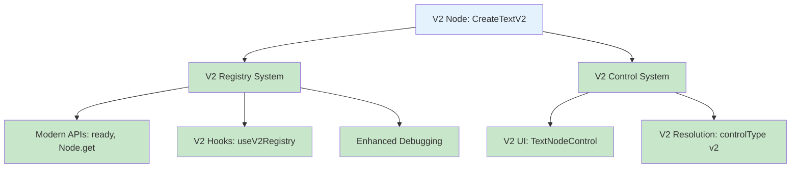
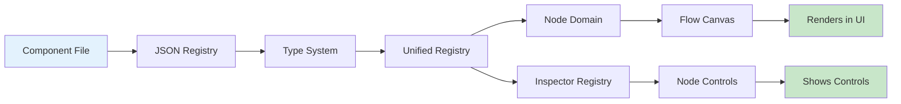

```mermaid
graph TD
    A[Start: Create New Node] --> B[Phase 1: Component Creation]
    B --> B1[Create YourNodeV2.tsx in /node-domain/category/]
    B1 --> B2[Add V2 Registry Hooks useV2Registry]
    B2 --> B3[Create Data Interface YourNodeV2Data]
    B3 --> B4[Add Fallback Configuration]
    B4 --> B5[Implement createNodeComponent with V2 patterns]

    B5 --> C[Phase 2: JSON Registry]
    C --> C1[Add entry to /generated/nodeRegistry.ts]
    C1 --> C2[Include V2 metadata and isExperimental: true]

    C2 --> D[Phase 3: Type System]
    D --> D1[Add interface to /types/nodeData.ts]
    D1 --> D2[Add to NodeData union type]
    D2 --> D3[Add to NodeType union]

    D3 --> E[Phase 4: System Registration]
    E --> E1[Add to unifiedRegistry.ts COMPONENTS]
    E1 --> E2[Add to SIMPLE_CONTROLS in unifiedRegistry.ts]
    E2 --> E3[Add to controlConfigs in generateInspectorControlMapping]
    E3 --> E4[Export from /node-domain/index.ts]
    E4 --> E5[Add to NODE_DOMAIN_REGISTRY]
    E5 --> E6[Add to NODES_BY_CATEGORY]
    E6 --> E7[Add to NODES_BY_FOLDER]
    E7 --> E8[Import in FlowCanvas.tsx]
    E8 --> E9[Add to nodeTypes mapping in FlowCanvas.tsx]
    E9 --> E10[Add fallback case to NodeControls.tsx]

    E10 --> F[Phase 5: Testing]
    F --> F1[Build project: npm run build]
    F1 --> F2[Check console for V2 registry logs]
    F2 --> F3[Verify node appears in sidebar]
    F3 --> F4{Node renders correctly?}

    F4 -->|Grey Box| G1[Check FlowCanvas.tsx nodeTypes mapping]
    F4 -->|Renders OK| F5[Check inspector controls]

    G1 --> G2[Verify node-domain export]
    G2 --> F4

    F5 --> F6{Controls working?}
    F6 -->|No Controls| H1[Check SIMPLE_CONTROLS in unifiedRegistry]
    F6 -->|Fallback Label| H2[Check generateInspectorControlMapping]
    F6 -->|Registry Label| I[Success: V2 Node Complete]

    H1 --> H3[Check NodeControls.tsx fallback]
    H2 --> H3
    H3 --> F6

    I --> J[Deploy and Monitor V2 Features]

    style A fill:#e1f5fe
    style I fill:#c8e6c9
    style J fill:#c8e6c9
    style F4 fill:#fff3e0
    style F6 fill:#fff3e0
    style G1 fill:#ffebee
    style H1 fill:#ffebee
    style H2 fill:#ffebee
```

# Adding New Nodes to the V2 System

This guide covers the complete process of adding new nodes to the modern V2 registry system, based on the successful implementation of CreateTextV2.

## 📊 Visual Process Flow



## 🚀 Simple Process (High-Level)

### Step 1: Create the Node Component

- Create your node component in the appropriate domain folder (`/node-domain/[category]/`)
- Use `createNodeComponent<T>()` from the factory system
- Include V2 registry hooks: `useV2Registry()` and `useV2NodeMetadata()`

### Step 2: Register in JSON Registry

- Add entry to `/json-node-registry/generated/nodeRegistry.ts`
- Include node metadata, handles, default data, and V2 flags

### Step 3: Update Type System

- Add data interface to `/types/nodeData.ts`
- Add node type to union types

### Step 4: Register in Multiple Systems

- Add to `unifiedRegistry.ts` COMPONENTS mapping
- Add to `node-domain/index.ts` exports
- Add to `FlowCanvas.tsx` nodeTypes mapping
- Add to `NodeControls.tsx` inspector controls

### Step 5: Test and Debug

- Create node in sidebar
- Verify rendering (should not be grey box)
- Check inspector controls (should show green "REGISTRY" label)
- Test V2 features and debugging

---

## ✅ Pure V2 System Architecture

Since the legacy system has been removed, everything is now part of the **unified V2 system**. The architecture is simplified:

### **V2 System Components**

#### **🎯 V2 Registry & Node Management**

- **Registry System**: Modern `ready()`, `Node.get()`, `normaliseHandleType()` APIs
- **Node Components**: Enhanced with V2 hooks, status indicators, debugging
- **Initialization**: Circular dependency fixes, async patterns
- **Type Safety**: Better TypeScript integration

#### **🎨 V2 Inspector Controls**

- **Control Components**: `TextNodeControl`, `TriggerOnToggleControl` (now part of V2)
- **Control Resolution**: V2 control system for finding and rendering UI components
- **Control Types**: V2 classification system ("v2", "factory", "none")

### **V2 Configuration**

```typescript
createTextV2: {
  controlType: "v2",  // ← Pure V2 control system
  v2ControlType: "TextNodeControl",  // ← V2 UI component
}
```

**Translation**: "This V2 node uses the V2 TextNodeControl UI component for its inspector controls."

### **Unified V2 System**



### **Benefits of Pure V2 System**

1. **✅ Unified Architecture**: Everything is V2 - no legacy/modern confusion
2. **✅ Proven Components**: Existing UI components migrated to V2 system
3. **✅ Clean APIs**: Modern patterns throughout
4. **✅ Future-Ready**: Ready for continued V2 evolution

---

## 🗂️ All Systems That Need Updates

### **Critical Systems (Required for Basic Functionality)**

| #   | System                          | File Path                                       | Purpose                            | Failure Result                |
| --- | ------------------------------- | ----------------------------------------------- | ---------------------------------- | ----------------------------- |
| 1   | **Component Creation**          | `/node-domain/[category]/YourNodeV2.tsx`        | The actual node component          | No component to render        |
| 2   | **JSON Registry**               | `/json-node-registry/generated/nodeRegistry.ts` | Node metadata and configuration    | Node not found in registry    |
| 3   | **Type System**                 | `/flow-engine/types/nodeData.ts`                | TypeScript interfaces and unions   | Type errors, no IntelliSense  |
| 4   | **Unified Registry Components** | `/json-node-registry/unifiedRegistry.ts`        | Component mapping for V2 registry  | Registry can't find component |
| 5   | **Node Domain Exports**         | `/node-domain/index.ts`                         | Export component for other systems | Import errors in other files  |
| 6   | **Flow Canvas Mapping**         | `/flow-engine/components/FlowCanvas.tsx`        | ReactFlow node type mapping        | **Grey box rendering**        |
| 7   | **Inspector Registry**          | `/json-node-registry/unifiedRegistry.ts`        | Inspector control configuration    | **No controls in inspector**  |
| 8   | **Inspector Fallback**          | `/node-inspector/components/NodeControls.tsx`   | Fallback control rendering         | Controls fail silently        |

### **V2-Specific Systems (Enhanced Features)**

| #   | System                   | File Path            | Purpose                                          | V2 Benefit                   |
| --- | ------------------------ | -------------------- | ------------------------------------------------ | ---------------------------- |
| 9   | **V2 Registry Hooks**    | `YourNodeV2.tsx`     | `useV2Registry()`, `useV2NodeMetadata()`         | Runtime registry integration |
| 10  | **V2 API Usage**         | `YourNodeV2.tsx`     | `ready()`, `Node.get()`, `normaliseHandleType()` | Modern API patterns          |
| 11  | **V2 Metadata**          | Registry & Component | `_v2RegistryVersion`, `_v2CreatedAt`             | Version tracking             |
| 12  | **V2 Status Indicators** | `YourNodeV2.tsx`     | Registry status UI elements                      | Enhanced debugging           |
| 13  | **V2 Error Handling**    | `YourNodeV2.tsx`     | Enhanced error states and recovery               | Better user experience       |

### **Registry Configuration Details**

#### **unifiedRegistry.ts (3 locations)**

```typescript
// 1. COMPONENTS mapping (line ~52) - V2 Registry System
const COMPONENTS: Record<string, any> = {
  yourNodeV2: YourNodeV2, // V2 component managed by V2 registry
};

// 2. V2_CONTROLS (line ~139) - V2 Inspector Control System
const V2_CONTROLS = {
  yourNodeV2: {
    controlType: "v2", // ← Pure V2 control system
    v2ControlType: "TextNodeControl", // ← V2 UI component
    hasControls: true,
  },
};

// 3. controlConfigs (line ~488) - V2 Control Resolution System
const controlConfigs = {
  yourNodeV2: {
    type: "v2", // ← V2 control rendering system
    v2ControlType: "TextNodeControl",
  },
};
```

#### **node-domain/index.ts (4 locations)**

```typescript
// 1. Export statement
export { default as YourNodeV2 } from "./your-category/YourNodeV2";

// 2. Registry mapping
export const NODE_DOMAIN_REGISTRY = {
  YourNodeV2: "yourNodeV2",
};

// 3. Category mapping
export const NODES_BY_CATEGORY = {
  [DOMAIN_CATEGORIES.YOUR_CATEGORY]: ["YourNodeV2"],
};

// 4. Folder mapping
export const NODES_BY_FOLDER = {
  [SIDEBAR_FOLDERS.TESTING]: ["YourNodeV2"],
};
```

#### **FlowCanvas.tsx (2 locations)**

```typescript
// 1. Import statement
import { YourNodeV2 } from "@/features/business-logic-modern/node-domain";

// 2. nodeTypes mapping
const nodeTypes = useMemo(
  () => ({
    yourNodeV2: YourNodeV2,
  }),
  []
);
```

### **System Dependencies**



### **Failure Modes and Diagnostics**

| Issue               | Missing System       | Diagnostic                            | Fix                          |
| ------------------- | -------------------- | ------------------------------------- | ---------------------------- |
| **Grey Box**        | FlowCanvas nodeTypes | Node renders as grey rectangle        | Add to FlowCanvas.tsx        |
| **No Sidebar**      | Node Domain exports  | Node doesn't appear in sidebar        | Add to node-domain/index.ts  |
| **No Controls**     | Inspector Registry   | Empty "Controls:" section             | Add to unifiedRegistry.ts    |
| **Type Errors**     | Type System          | TypeScript compilation errors         | Add to nodeData.ts           |
| **Registry Errors** | JSON Registry        | Console errors about missing node     | Add to nodeRegistry.ts       |
| **Import Errors**   | Component Creation   | Cannot import component               | Create component file        |
| **Fallback Labels** | Inspector Controls   | Amber "FALLBACK" warnings             | Check registry configuration |
| **Circular Deps**   | Component Structure  | "Cannot access before initialization" | Use fallback configuration   |

---

## 🔧 Detailed Process (Step-by-Step)

### Phase 1: Component Creation

#### 1.1 Create Node Component File

Create `/node-domain/[category]/YourNodeV2.tsx`:

```typescript
// Essential imports
import { createNodeComponent } from "@infrastructure/node-creation/factory";
import {
  ready,
  Node,
  normaliseHandleType,
} from "@infrastructure/node-creation/json-node-registry/unifiedRegistry";
import { useState, useEffect } from "react";

// V2 Registry Hooks
function useV2Registry() {
  const [isReady, setIsReady] = useState(false);
  const [error, setError] = useState<string | null>(null);

  useEffect(() => {
    ready()
      .then(() => setIsReady(true))
      .catch((err) => setError(err.message));
  }, []);

  return { isReady, error };
}

// Data Interface
interface YourNodeV2Data extends BaseNodeData {
  // Your specific data fields
  text: string;
  // V2 metadata
  _v2RegistryVersion?: string;
  _v2CreatedAt?: number;
}

// Fallback Configuration (for safe initialization)
function createV2FallbackConfiguration() {
  return {
    nodeType: "yourNodeV2" as const,
    category: "your-category" as const,
    displayName: "Your Node V2",
    defaultData: {
      // Your default data
      text: "",
      _v2RegistryVersion: "2.0.0",
      _v2CreatedAt: Date.now(),
    } as YourNodeV2Data,
    size: STANDARD_SIZE_PATTERNS.WIDE_TEXT, // or your preferred size
    handles: [
      // Your handles with proper types
      {
        id: "input",
        dataType: "s" as const,
        position: Position.Left,
        type: "target" as const,
      },
    ],
  };
}

// Main Component
const YourNodeV2 = createNodeComponent<YourNodeV2Data>({
  ...createV2FallbackConfiguration(),

  processLogic: ({ data, updateNodeData, id, setError }) => {
    // Your processing logic
  },

  renderCollapsed: ({ data, error, updateNodeData, id }) => {
    const { isReady } = useV2Registry();
    // Your collapsed UI with V2 indicators
  },

  renderExpanded: ({ data, error, updateNodeData, id }) => {
    // Your expanded UI
  },
});

export default YourNodeV2;
```

### Phase 2: JSON Registry Registration

#### 2.1 Add to Generated Registry

In `/json-node-registry/generated/nodeRegistry.ts`, add:

```typescript
yourNodeV2: {
  nodeType: "yourNodeV2",
  category: "your-category",
  displayName: "Your Node V2",
  description: "V2 implementation with enhanced features",
  icon: "your-icon",
  folder: "testing", // or "main"
  order: 2,

  // Dimensions
  iconWidth: 240,
  iconHeight: 120,
  expandedWidth: 240,
  expandedHeight: 120,

  // UI Configuration
  hasToggle: true,
  isEnabled: true,
  isExperimental: true, // Mark as V2

  // Handles
  handles: [
    {
      id: "input",
      type: "target",
      position: "left",
      dataType: "string",
      description: "Input description",
    },
    {
      id: "output",
      type: "source",
      position: "right",
      dataType: "string",
      description: "Output description",
    },
  ],

  // Default data with V2 metadata
  defaultData: {
    text: "",
    _v2RegistryVersion: "2.0.0",
    _v2CreatedAt: Date.now(),
  },
},
```

### Phase 3: Type System Integration

#### 3.1 Add Data Interface

In `/types/nodeData.ts`:

```typescript
// Add your data interface
export interface YourNodeV2Data extends BaseNodeData {
  text: string;
  // V2 metadata
  _v2RegistryVersion?: string;
  _v2CreatedAt?: number;
}

// Add to union type
export type NodeData =
  | CreateTextData
  | YourNodeV2Data // Add this line
  | ViewOutputData;
// ... other types

// Add to AgenNode type
export type NodeType =
  | "createText"
  | "yourNodeV2" // Add this line
  | "viewOutput";
// ... other types
```

### Phase 4: System Registration (Critical!)

#### 4.1 Add to Unified Registry Components

In `/unifiedRegistry.ts`:

```typescript
// Add import
import YourNodeV2 from "../../../node-domain/your-category/YourNodeV2";

// Add to COMPONENTS mapping
const COMPONENTS: Record<string, any> = {
  createText: CreateText,
  yourNodeV2: YourNodeV2, // Add this line
  // ... other components
};
```

#### 4.2 Add Inspector Controls

In `/unifiedRegistry.ts`, in `initInspectorControls()`:

```typescript
const SIMPLE_CONTROLS = {
  createText: {
    controlType: "legacy",
    legacyControlType: "TextNodeControl",
    hasControls: true,
  },
  yourNodeV2: {
    controlType: "legacy",
    legacyControlType: "TextNodeControl",
    hasControls: true,
  }, // Add this
  // ... other controls
};
```

And in `generateInspectorControlMapping()`:

```typescript
const controlConfigs = {
  createText: { type: "legacy", legacyControlType: "TextNodeControl" },
  yourNodeV2: { type: "legacy", legacyControlType: "TextNodeControl" }, // Add this
  // ... other configs
};
```

#### 4.3 Export from Node Domain

In `/node-domain/index.ts`:

```typescript
// Add export
export { default as YourNodeV2 } from "./your-category/YourNodeV2";

// Add to registry mapping
export const NODE_DOMAIN_REGISTRY = {
  CreateText: "createText",
  YourNodeV2: "yourNodeV2", // Add this line
  // ... other mappings
};

// Add to category mapping
export const NODES_BY_CATEGORY = {
  [DOMAIN_CATEGORIES.YOUR_CATEGORY]: ["YourNodeV2"], // Add this
  // ... other categories
};

// Add to folder mapping
export const NODES_BY_FOLDER = {
  [SIDEBAR_FOLDERS.TESTING]: ["TestError", "YourNodeV2"], // Add this
  // ... other folders
};
```

#### 4.4 Add to Flow Canvas

In `/FlowCanvas.tsx`:

```typescript
// Add import
import { YourNodeV2 } from "@/features/business-logic-modern/node-domain";

// Add to nodeTypes mapping
const nodeTypes = useMemo(
  () => ({
    createText: CreateText,
    yourNodeV2: YourNodeV2, // Add this line
    // ... other types
  }),
  []
);
```

#### 4.5 Add to Node Controls Fallback

In `/NodeControls.tsx`:

```typescript
// Add to fallback strategy
switch (validNodeType) {
  case "createText":
    return (/* CreateText fallback */);
  case "yourNodeV2":  // Add this case
    return (
      <div>
        <div className="text-xs text-amber-600 dark:text-amber-400 mb-2 p-1 bg-amber-50 dark:bg-amber-900/20 rounded border">
          ⚠️ FALLBACK: V2 Registry control failed for {validNodeType}
        </div>
        <TextNodeControl node={node} updateNodeData={updateNodeData} />
      </div>
    );
  // ... other cases
}
```

### Phase 5: Testing and Debugging

#### 5.1 Verify Registration

1. **Build the project**: `npm run build`
2. **Check console**: Look for V2 registry initialization logs
3. **Test sidebar**: Node should appear in the correct folder
4. **Create node**: Should render properly (not grey box)

#### 5.2 Verify Inspector Controls

1. **Select your node**
2. **Check inspector panel**: Should show controls
3. **Look for labels**:
   - ✅ **Green "REGISTRY"**: V2 registry working perfectly
   - ⚠️ **Amber "FALLBACK"**: Registry failed, needs investigation
   - 🏭 **Blue "FACTORY"**: Using factory controls
   - 🚫 **Gray "NO CONTROLS"**: No controls by design

#### 5.3 Debug Common Issues

**Grey Box Rendering:**

- Check if component is in `FlowCanvas.tsx` nodeTypes mapping
- Verify component is exported from `node-domain/index.ts`

**No Inspector Controls:**

- Check `SIMPLE_CONTROLS` in `unifiedRegistry.ts`
- Verify fallback case in `NodeControls.tsx`
- Look for amber "FALLBACK" labels

**Circular Dependency Errors:**

- Ensure component doesn't call registry functions during module initialization
- Use fallback configuration for initial setup
- Access registry only in hooks/effects

---

## 🎯 V2 Features to Include

### Essential V2 Patterns

1. **V2 Registry Hooks**: `useV2Registry()`, `useV2NodeMetadata()`
2. **V2 API Usage**: `ready()`, `Node.get()`, `normaliseHandleType()`
3. **V2 Metadata**: Include `_v2RegistryVersion` and `_v2CreatedAt`
4. **V2 Error Handling**: Enhanced error states with specific indicators
5. **V2 Status Indicators**: Show registry status in UI

### V2 Debugging Features

1. **Registry Status**: Show when V2 registry is ready/loading
2. **Performance Metrics**: Track V2-specific performance indicators
3. **Type Safety**: Direct type inference without manual casting
4. **Enhanced Logging**: V2-branded console logs and errors

---

## ⚠️ Common Pitfalls

1. **Forgetting FlowCanvas mapping**: Node will render as grey box
2. **Missing inspector controls**: Controls section will be empty
3. **Circular dependencies**: Use fallback configuration pattern
4. **Type mismatches**: Ensure HandleConfig types are properly cast
5. **Missing exports**: Node won't appear in sidebar

---

## ✅ Success Checklist

- [ ] Component created with V2 hooks and fallback configuration
- [ ] Added to GENERATED_NODE_REGISTRY with V2 metadata
- [ ] Data interface added to nodeData.ts
- [ ] Added to unifiedRegistry.ts COMPONENTS mapping
- [ ] Inspector controls configured in unifiedRegistry.ts
- [ ] Exported from node-domain/index.ts
- [ ] Added to FlowCanvas.tsx nodeTypes mapping
- [ ] Fallback case added to NodeControls.tsx
- [ ] Node appears in sidebar
- [ ] Node renders properly (not grey box)
- [ ] Inspector shows green "REGISTRY" label
- [ ] V2 features and debugging work correctly

By following this process, you'll have a fully functional V2 node that demonstrates the modern registry system's capabilities while maintaining backward compatibility.
