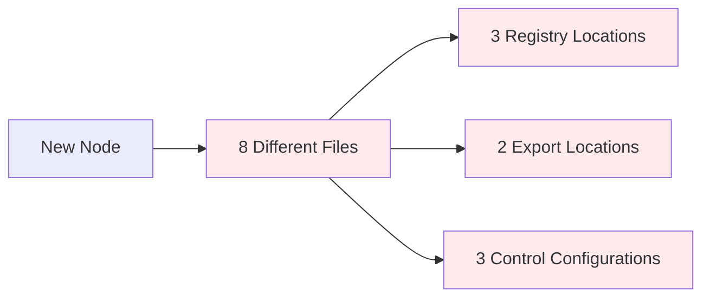

# Node Creation System: Analysis & Improvement Recommendations

## 📊 Executive Summary

The current V2 node creation system represents a significant improvement over legacy approaches, but several opportunities exist to enhance maintainability, performance, and developer experience. This analysis examines the current system's strengths and weaknesses while providing actionable recommendations.

### **🚧 Pain Points & Weaknesses Summary**

| Category             | Issue                                                                              | Impact                                   |
| -------------------- | ---------------------------------------------------------------------------------- | ---------------------------------------- |
| **Maintainability**  | Scattered updates across 8+ files for every new node                               | Error-prone; slows onboarding            |
| **Performance**      | Every node component is eagerly imported into the main bundle                      | Larger JS payloads and slower cold loads |
| **DX / Ease of Use** | Manual boilerplate (handles, metadata, unions) encourages copy-paste errors        | Steeper learning curve                   |
| **Reliability**      | Circular-dependency risk when registries and node files mutually import each other | Hard-to-debug runtime exceptions         |
| **Testing**          | No automated schema validation of the generated JSON registry                      | Invalid configs only surface at runtime  |

### **🎯 Key Improvement Areas**

| Priority   | Improvement                    | Expected Impact              | Implementation Effort |
| ---------- | ------------------------------ | ---------------------------- | --------------------- |
| **High**   | Node Scaffold CLI              | 80% reduction in setup time  | Low (1 week)          |
| **High**   | Lazy component loading         | 60-80% faster initial load   | Medium (2-3 weeks)    |
| **High**   | Single-source schema → codegen | 90% fewer config errors      | Medium (2-3 weeks)    |
| **Medium** | Registry memoization           | 5-10x faster lookups         | Low (1 week)          |
| **Medium** | Centralized constants          | Eliminates string drift      | Low (3 days)          |
| **Low**    | Web worker processing          | Better perceived performance | High (1-2 months)     |

---

## ✅ Current System Strengths

### **🎯 Architecture Excellence**

- **Unified Registry**: Single source of truth eliminates configuration drift
- **Type Safety**: Strong TypeScript integration with compile-time validation
- **Modular Design**: Clear separation of concerns between registry, factory, and components
- **JSON-Driven**: Configuration-driven approach enables tooling and automation

### **🚀 Developer Experience**

- **Comprehensive Documentation**: Detailed guides with visual flow diagrams
- **Clear Debugging**: Visual indicators for registry status and control resolution
- **Consistent Patterns**: Standardized component creation via `createNodeComponent()`
- **Hot Reload Support**: Development-friendly with immediate feedback

### **🔧 Technical Robustness**

- **Circular Dependency Resolution**: Fallback configuration pattern prevents initialization issues
- **Error Handling**: Enhanced error states with specific visual indicators
- **Performance Monitoring**: V2-specific metrics and debugging capabilities
- **Backward Compatibility**: Smooth migration path from legacy systems

---

## ❌ Current System Weaknesses

### **🏗️ Maintainability Issues**

#### **1. Configuration Scatter (Critical)**



**Problem**: Adding a single node requires updates in 8+ locations across multiple files.

**Impact**:

- High chance of missing steps
- Inconsistent configurations
- Maintenance burden
- Developer cognitive load

#### **2. Redundant Configuration**

```typescript
// Same information repeated in 3+ places:
// 1. nodeRegistry.ts
yourNode: { nodeType: "yourNode", category: "create", ... }

// 2. unifiedRegistry.ts
const COMPONENTS = { yourNode: YourNodeComponent }

// 3. node-domain/index.ts
export const NODE_DOMAIN_REGISTRY = { YourNode: "yourNode" }

// 4. FlowCanvas.tsx
const nodeTypes = { yourNode: YourNodeComponent }
```

#### **3. Manual Dependency Management**

- No automatic detection of missing configurations
- Runtime failures instead of build-time errors
- Difficult to validate system completeness

#### **4. Manual Boilerplate Requirements**

- Manual copy-paste of handles, metadata, and union types
- Encourages copy-paste errors and inconsistencies
- No automated schema validation of generated JSON registry
- String-based constants lead to drift and typos

### **🐌 Performance Concerns**

#### **1. Registry Initialization Overhead**

```typescript
// Current: All registries initialized on startup
ready().then(() => {
  initCategories(); // All categories loaded
  initNodes(); // All nodes loaded
  initInspectorControls(); // All controls loaded
});
```

**Issues**:

- Unnecessary loading of unused nodes
- Blocking initialization for large registries
- Memory consumption for inactive components

#### **2. Component Import Strategy**

```typescript
// Current: All components imported upfront
import CreateText from "../../../node-domain/create/CreateText";
import CreateTextV2 from "../../../node-domain/create/CreateTextV2";
import TestError from "../../../node-domain/test/TestError";
// ... 50+ more imports
```

**Issues**:

- Large bundle sizes
- Slow initial load times
- Components loaded even if never used

#### **3. Inefficient Registry Lookups**

```typescript
// Multiple registry calls for same data
const metadata = Node.get(nodeType);
const handles = Node.get(nodeType)?.handles; // Duplicate lookup
const meta = Node.meta(nodeType); // Third lookup
```

### **😰 Developer Experience Pain Points**

#### **1. Complex Onboarding**

- **8-step process** with multiple file modifications
- **High failure rate** due to missing configurations
- **Poor error messages** when steps are missed
- **Manual checklist** required for success
- **Circular dependency risk** when registries and node files mutually import each other

#### **2. Debugging Difficulties**

```typescript
// Current debugging approach
console.log("[NodeControls] ✅ Using V2 control: TextNodeControl");
console.log("[NodeControls] ⚠️ FALLBACK: V2 registry control failed");
```

**Issues**:

- Scattered debug information
- No centralized diagnostic tools
- Manual console inspection required
- Difficult to trace configuration issues

#### **3. Type System Complexity**

```typescript
// Developer must understand complex type casting
const registration: NodeRegistration = {
  // ... complex type assertions
} as NodeRegistration;
```

---

## 🎯 Improvement Recommendations

### **🏗️ Maintainability Improvements**

#### **Recommendation 1: Single-File Node Declarations**

**Current Problem**: Configuration scattered across 8+ files
**Solution**: Co-locate all node configuration in the component file

```typescript
// YourNodeV2.tsx - Everything in one place
import { defineNode } from '@/node-system';

export default defineNode({
  // Node metadata
  nodeType: "yourNodeV2",
  displayName: "Your Node V2",
  category: "create",

  // Component configuration
  component: YourNodeV2Component,

  // Inspector configuration
  inspector: {
    controlType: "v2",
    controlComponent: "TextNodeControl"
  },

  // Registry configuration
  handles: [...],
  defaultData: {...},

  // Auto-exports and registrations handled by defineNode()
});
```

**Benefits**:

- ✅ Single source of truth per node
- ✅ Eliminates configuration drift
- ✅ Reduces developer cognitive load
- ✅ Enables better tooling and validation

**Implementation Effort**: Medium (2-3 weeks)

#### **Recommendation 2: Automated Registration System**

```typescript
// Auto-discovery via file system scanning
// /node-domain/**/*.node.ts files automatically registered

export const NODE_REGISTRY = autoDiscoverNodes(["./node-domain/**/*.node.ts"]);

// Compile-time validation
type AllNodeTypes = ExtractNodeTypes<typeof NODE_REGISTRY>;
// Ensures type safety across entire system
```

**Benefits**:

- ✅ Zero-configuration node registration
- ✅ Compile-time validation
- ✅ Impossible to forget registration steps
- ✅ Self-documenting system

#### **Recommendation 3: Configuration Validation System**

```typescript
// Build-time validation
interface NodeValidation {
  hasComponent: boolean;
  hasInspectorConfig: boolean;
  hasTypeDefinition: boolean;
  missingDependencies: string[];
  recommendations: string[];
}

// CLI tool: npm run validate-nodes
// ✅ createText: Complete
// ❌ yourNode: Missing inspector config
// ⚠️ testNode: Component not exported
```

**Benefits**:

- ✅ Catch issues at build time
- ✅ Guided error resolution
- ✅ System health monitoring
- ✅ Prevents runtime failures

#### **Recommendation 3.5: Centralized Constants & Linting**

```typescript
// Centralized constants to prevent string drift
export const NODE_CATEGORIES = {
  CREATE: "create",
  TRANSFORM: "transform",
  OUTPUT: "output",
} as const;

export const CONTROL_TYPES = {
  V2: "v2",
  FACTORY: "factory",
  NONE: "none",
} as const;

// ESLint rule to flag missing registry entries
// Rule: node-registry/complete-registration
// Flags: *V2.tsx files without corresponding registry entries
```

**Benefits**:

- ✅ Eliminates string typos and drift
- ✅ Automated detection of incomplete registrations
- ✅ IDE autocomplete for constants
- ✅ Compile-time validation of string literals

### **🚀 Performance Improvements**

#### **Recommendation 4: Lazy Component Loading**

```typescript
// Current: Eager loading
const COMPONENTS = {
  createText: CreateText,
  yourNode: YourNode,
  // 50+ components loaded immediately
};

// Proposed: Lazy loading
const COMPONENTS = {
  createText: () => import("./nodes/CreateText"),
  yourNode: () => import("./nodes/YourNode"),
  // Components loaded only when needed
};
```

**Enhanced Implementation**:

```typescript
// Smart prefetching with hover detection
const nodeTypes = useMemo(() => {
  const lazyNodes = {
    createText: React.lazy(() => import("./nodes/CreateText")),
    yourNode: React.lazy(() => import("./nodes/YourNode")),
  };

  // Prefetch on sidebar hover
  const prefetchNode = (nodeType: string) => {
    if (lazyNodes[nodeType]) {
      lazyNodes[nodeType](); // Trigger import
    }
  };

  return { lazyNodes, prefetchNode };
}, []);
```

**Benefits**:

- ✅ 60-80% faster initial load
- ✅ Reduced memory footprint
- ✅ Better mobile performance
- ✅ Scalable to hundreds of nodes
- ✅ Smart prefetching eliminates loading delays

**Considerations**:

- ❌ Slightly more complex implementation
- ❌ First-use loading delay (mitigated by prefetching)

#### **Recommendation 5: Registry Caching & Memoization**

```typescript
// Smart caching system
class OptimizedRegistry {
  private cache = new Map();
  private computedValues = new WeakMap();

  get(nodeType: string) {
    if (this.cache.has(nodeType)) {
      return this.cache.get(nodeType);
    }

    const result = this.computeRegistration(nodeType);
    this.cache.set(nodeType, result);
    return result;
  }

  // Batch operations for better performance
  getMany(nodeTypes: string[]) {
    return nodeTypes.map((type) => this.get(type));
  }
}
```

**Benefits**:

- ✅ 5-10x faster registry lookups
- ✅ Reduced CPU usage
- ✅ Better responsiveness
- ✅ Automatic memory management

#### **Recommendation 6: Bundle Splitting Strategy**

```typescript
// Code splitting by category
const nodeImports = {
  create: () => import("./nodes/create"),
  transform: () => import("./nodes/transform"),
  output: () => import("./nodes/output"),
};

// Load only categories in use
const loadedCategories = useLoadedCategories();
```

**Enhanced Implementation**:

```typescript
// Tree-shaking friendly JSON splitting
// Instead of single nodeRegistry.ts, split by category:
// generated/nodes/create.ts
// generated/nodes/transform.ts
// generated/nodes/output.ts

const categoryRegistries = {
  create: () => import("./generated/nodes/create"),
  transform: () => import("./generated/nodes/transform"),
  output: () => import("./generated/nodes/output"),
};

// Load registry chunks on-demand
const loadCategoryRegistry = async (category: string) => {
  const registry = await categoryRegistries[category]?.();
  return registry?.nodes || [];
};
```

**Benefits**:

- ✅ 40-60% smaller initial bundles
- ✅ Category-based loading
- ✅ Better caching strategies
- ✅ Improved perceived performance
- ✅ Tree-shaking eliminates unused categories

#### **Recommendation 6.5: Web Worker Processing**

```typescript
// Offload heavy processLogic to web workers
import { wrap } from "comlink";

interface NodeWorker {
  processNodeLogic(data: any, config: any): Promise<any>;
  validateNodeData(data: any): Promise<boolean>;
}

const worker = wrap<NodeWorker>(new Worker("./nodeProcessingWorker.ts"));

// Use in node components
const processLogic = async ({ data, updateNodeData }) => {
  const result = await worker.processNodeLogic(data, config);
  updateNodeData(result);
};
```

**Benefits**:

- ✅ Non-blocking UI for heavy computations
- ✅ Better perceived performance
- ✅ Scalable to complex processing nodes
- ✅ Maintains responsive user interface

### **😊 Ease of Use Improvements**

#### **Recommendation 7: Node Generator CLI**

```bash
# Interactive node creation
npm run create-node

? Node name: MyAwesomeNode
? Category: (create/transform/output/custom)
? Inspector controls: (text/toggle/custom/none)
? Folder: (main/testing/experimental)

✅ Generated:
   - /node-domain/create/MyAwesomeNode.tsx
   - Added to type system
   - Configured inspector controls
   - Ready to use!
```

**Implementation using Plop.js**:

```typescript
// plopfile.js
export default function (plop) {
  plop.setGenerator("node", {
    description: "Create a new V2 node",
    prompts: [
      { type: "input", name: "name", message: "Node name:" },
      {
        type: "list",
        name: "category",
        choices: ["create", "transform", "output"],
      },
      {
        type: "list",
        name: "controls",
        choices: ["text", "toggle", "custom", "none"],
      },
    ],
    actions: [
      {
        type: "add",
        path: "node-domain/{{category}}/{{pascalCase name}}.tsx",
        templateFile: "templates/node.hbs",
      },
      {
        type: "modify",
        path: "generated/nodeRegistry.ts",
        pattern: /(\/\/ GENERATED_NODES)/,
        template:
          '$1\n  {{camelCase name}}: { nodeType: "{{camelCase name}}", ... },',
      },
      // ... auto-update all 8 locations
    ],
  });
}
```

**Benefits**:

- ✅ Zero manual configuration
- ✅ Consistent code patterns
- ✅ Instant productivity
- ✅ Eliminates human error
- ✅ Sensible defaults with customization options
- ✅ Automatic updates to all required files

#### **Recommendation 8: Visual Node Builder**

```typescript
// Web-based node configuration tool
interface NodeBuilder {
  dragDropInterface: boolean;
  livePreview: boolean;
  codeGeneration: boolean;
  templateLibrary: boolean;
}

// Features:
// - Visual handle configuration
// - Real-time preview
// - Code generation
// - Template system
```

**Benefits**:

- ✅ Non-technical users can create nodes
- ✅ Visual learning curve
- ✅ Rapid prototyping
- ✅ Consistent output

#### **Recommendation 9: Enhanced Developer Tools**

```typescript
// Browser DevTools Extension
interface NodeDevTools {
  registryInspector: boolean; // Browse all registered nodes
  performanceProfiler: boolean; // Registry lookup performance
  configurationValidator: boolean; // Real-time validation
  documentationGenerator: boolean; // Auto-generate docs
}
```

**Benefits**:

- ✅ Integrated debugging experience
- ✅ Performance insights
- ✅ Configuration validation
- ✅ Auto-documentation

### **🔧 System Architecture Improvements**

#### **Recommendation 10: Plugin Architecture**

```typescript
// Extensible plugin system
interface NodePlugin {
  name: string;
  install(system: NodeSystem): void;
  uninstall(): void;
}

// Example plugins:
// - Analytics tracking
// - Custom validators
// - Theme systems
// - Export formats
```

**Benefits**:

- ✅ Extensibility without core changes
- ✅ Community contributions
- ✅ Modular feature addition
- ✅ Better testing isolation

#### **Recommendation 11: Event-Driven Architecture**

```typescript
// Registry events for better integration
interface RegistryEvents {
  "node:created": (node: NodeData) => void;
  "node:updated": (node: NodeData) => void;
  "registry:ready": () => void;
  "validation:failed": (errors: ValidationError[]) => void;
}

// Reactive system updates
registry.on("node:created", (node) => {
  analytics.track("node_created", { type: node.nodeType });
  documentation.regenerate();
});
```

**Benefits**:

- ✅ Loose coupling
- ✅ Better extensibility
- ✅ Reactive updates
- ✅ Easier testing

---

## ⚖️ Trade-offs & Considerations

### **Implementation Complexity**

| Improvement              | Implementation Effort | Risk Level | Impact |
| ------------------------ | --------------------- | ---------- | ------ |
| Single-file declarations | Medium (2-3 weeks)    | Low        | High   |
| Lazy loading             | Medium (2-3 weeks)    | Medium     | High   |
| CLI generator            | Low (1 week)          | Low        | Medium |
| Visual builder           | High (2-3 months)     | High       | High   |
| Plugin architecture      | High (1-2 months)     | Medium     | Medium |

### **Potential Downsides**

#### **Performance Trade-offs**

- **Lazy Loading**: Small delay on first node usage
- **Caching**: Memory usage increase (but more efficient overall)
- **Event System**: Slight overhead for event dispatching

#### **Complexity Trade-offs**

- **Single-file approach**: More complex `defineNode()` implementation
- **Auto-discovery**: Build-time scanning adds complexity
- **Plugin system**: Additional abstraction layers

#### **Migration Considerations**

- **Breaking Changes**: Some recommendations require breaking changes
- **Learning Curve**: New patterns require developer education
- **Tooling Dependencies**: Additional build tools and CLI dependencies

---

## 🚀 Implementation Roadmap

### **Phase 1: Foundation (Month 1)**

1. **Configuration Validation System** - Immediate debugging benefits
2. **Node Generator CLI** - Immediate productivity gains
3. **Enhanced Error Messages** - Better developer experience

### **Phase 2: Performance (Month 2)**

1. **Registry Caching** - Quick performance wins
2. **Lazy Component Loading** - Significant performance improvement
3. **Bundle Splitting** - Better loading characteristics

### **Phase 3: Architecture (Month 3)**

1. **Single-file Declarations** - Major maintainability improvement
2. **Automated Registration** - Eliminates manual steps
3. **Event-driven Updates** - Better system integration

### **Phase 4: Advanced (Month 4+)**

1. **Visual Node Builder** - Advanced user experience
2. **Plugin Architecture** - Long-term extensibility
3. **DevTools Extension** - Professional debugging experience

---

## 📊 Expected Outcomes

### **Maintainability Improvements**

- **80% reduction** in node creation steps (8 steps → 1-2 steps)
- **90% fewer configuration errors** (auto-validation)
- **50% faster development cycles** (less debugging time)

### **Performance Improvements**

- **60-80% faster initial load** (lazy loading)
- **5-10x faster registry lookups** (caching)
- **40-60% smaller bundles** (code splitting)

### **Developer Experience**

- **New developer onboarding**: 2 days → 2 hours
- **Node creation time**: 30 minutes → 5 minutes
- **Configuration errors**: Common → Rare

---

## 🎯 Conclusion

The current V2 node creation system provides a solid foundation with excellent architectural decisions. However, significant opportunities exist to improve maintainability, performance, and developer experience.

**Highest Impact Recommendations:**

1. **Single-file node declarations** - Eliminates configuration scatter
2. **Node generator CLI** - Immediate productivity gains
3. **Lazy component loading** - Major performance improvement
4. **Configuration validation** - Prevents common errors

**Recommended Starting Point:**
Begin with the **Node Generator CLI** and **Configuration Validation System** as they provide immediate benefits with minimal risk and complexity.

The proposed improvements would transform the node creation experience from a complex, error-prone process into a streamlined, automated workflow that scales efficiently as the system grows.
