# 🏭 Enterprise Node Factory System

> **A sophisticated, enterprise-grade factory system for creating and managing interactive nodes with performance optimization, type safety, and modular architecture.**

[](https://www.typescriptlang.org/)
[](https://reactjs.org/)
[](#-performance-systems)
[](#-enterprise-features)

## 📋 Table of Contents

- [🎯 Overview](#-overview)
- [🏗️ Architecture](#️-architecture)
- [🚀 Quick Start](#-quick-start)
- [📊 System Layers](#-system-layers)
- [⚡ Performance Systems](#-performance-systems)
- [🛡️ Enterprise Features](#️-enterprise-features)
- [🧩 Core Components](#-core-components)
- [📁 Project Structure](#-project-structure)
- [🔧 Advanced Usage](#-advanced-usage)
- [🧪 Testing & Debugging](#-testing--debugging)

## 🎯 Overview

The Node Factory System is a **comprehensive, enterprise-grade solution** for creating, managing, and rendering interactive nodes in a visual flow editor. It combines **JSON-driven configuration**, **type-safe factory patterns**, and **advanced performance optimizations** to deliver a seamless developer and user experience.

### Key Highlights

- 🎯 **Unified API** - Single interface for all node operations
- 🔄 **JSON Registry Integration** - Data-driven node definitions
- ⚡ **Ultra-Fast Performance** - GPU acceleration, state machines, and memory optimization
- 🛡️ **Enterprise Safety** - Error boundaries, state isolation, and memory management
- 🧩 **Modular Architecture** - Composable hooks and systems
- 📏 **Type Safety** - Comprehensive TypeScript throughout
- 🔧 **Developer Experience** - Rich debugging tools and clear APIs

## 🏗️ Architecture

### System Architecture Overview

The factory system implements a sophisticated **multi-layer delegation pattern** with clear separation between **data creation** and **component rendering**:

```mermaid
graph TB
    A["🌐 Application Layer"] --> B["📦 Unified Factory API<br/>(index.ts)"]

    B --> C["🔄 Integration Layer<br/>(UnifiedIntegration.ts)"]
    B --> D["⚛️ Component Factory<br/>(NodeFactory.tsx)"]

    C --> E["🗃️ JSON Registry Adapter<br/>(Singleton)"]
    C --> F["📋 Legacy Factory Support"]

    E --> G["📊 JSON Registry Cache"]

    D --> H["🛡️ Safety Layers"]
    D --> I["🎣 Hook Ecosystem"]
    D --> J["⚡ Performance Systems"]

    H --> K["💾 SafeStateLayer"]
    H --> L["🔄 DataFlowController"]

    I --> M["🎯 useNodeProcessing"]
    I --> N["📊 useNodeState"]
    I --> O["🔗 useNodeConnections"]

    J --> P["🚀 UltraFastPropagation"]
    J --> Q["🎱 Object Pooling"]
    J --> R["🖥️ GPU Acceleration"]

    style A fill:#e1f5fe
    style B fill:#f3e5f5
    style H fill:#e8f5e8
    style J fill:#fff3e0
```



### Architectural Principles

| Principle                  | Implementation                         | Benefit                             |
| -------------------------- | -------------------------------------- | ----------------------------------- |
| **Separation of Concerns** | Data creation vs Component rendering   | Independent testing and maintenance |
| **Single Responsibility**  | Each hook handles one specific concern | Modular, reusable code              |
| **Performance First**      | Multiple optimization layers           | Smooth 60fps interactions           |
| **Type Safety**            | Comprehensive TypeScript coverage      | Compile-time error prevention       |
| **Enterprise Ready**       | Error boundaries, memory management    | Production stability                |

## 🚀 Quick Start

### Basic Node Creation

```typescript
import { unifiedFactory } from "@factory";

// Create a text node
const textNode = unifiedFactory.createNode(
  "createText",
  { x: 100, y: 100 },
  { text: "Hello World" }
);

// Validate node type
if (unifiedFactory.isValidNodeType("createText")) {
  console.log("✅ CreateText is supported");
}

// Get node metadata
const metadata = unifiedFactory.getNodeMetadata("createText");
const handles = unifiedFactory.getNodeHandles("createText");
```

### Creating Custom Node Components

```typescript
import { createNodeComponent } from "@factory";

interface MyNodeData {
  title: string;
  value: number;
  isActive: boolean;
}

const MyCustomNode = createNodeComponent<MyNodeData>({
  nodeType: "myCustomNode",
  category: "utility",
  displayName: "My Custom Node",
  defaultData: {
    title: "Default Title",
    value: 0,
    isActive: false
  },
  processLogic: ({ data, updateNodeData, id }) => {
    // Your business logic here
    if (data.value > 10) {
      updateNodeData(id, { isActive: true });
    }
  },
  renderCollapsed: ({ data, updateNodeData, id }) => (
    <div className="p-2 text-center">
      <span>{data.title}</span>
    </div>
  ),
  renderExpanded: ({ data, updateNodeData, id }) => (
    <div className="p-4 space-y-2">
      <input
        value={data.title}
        onChange={(e) => updateNodeData(id, { title: e.target.value })}
      />
      <input
        type="number"
        value={data.value}
        onChange={(e) => updateNodeData(id, { value: +e.target.value })}
      />
    </div>
  )
});
```

### Using with Safety Layers

```typescript
import { SafetyLayersProvider, createNodeComponent } from "@factory";

function MyApp() {
  return (
    <SafetyLayersProvider>
      {/* Your flow editor components */}
      <FlowCanvas />
    </SafetyLayersProvider>
  );
}
```

## 📊 System Layers

### Layer 1: Public API (`index.ts`)

The unified entry point that provides a clean, consistent interface.

```typescript
// Exports the main factory interface
export {
  unifiedFactory,
  createUnifiedFactory,
} from "./core/UnifiedIntegration";
export { createNodeComponent, SafetyLayersProvider } from "./NodeFactory";
export type * from "./types";
```

### Layer 2: Unified Integration (`UnifiedIntegration.ts`)

Intelligent routing between JSON registry and legacy systems.

```typescript
class UnifiedFactoryImpl implements UnifiedNodeFactory {
  createNode(type, position, customData) {
    // Try JSON registry first, fallback to legacy
    return this.createNodeWithJsonFirst(type, position, customData);
  }

  // Comprehensive caching and metrics
  private cache = new Map<string, any>();
  private metrics = { jsonRegistryHits: 0, fallbacks: 0 };
}
```

### Layer 3: JSON Registry Adapter (`jsonRegistryAdapter.ts`)

Singleton pattern for efficient node configuration management.

```typescript
export class JsonRegistryAdapter {
  private static instance: JsonRegistryAdapter;
  private registryCache: Record<string, JsonNodeConfig> = {};

  public createNode(nodeType, position, customData): AgenNode | null {
    const config = this.registryCache[nodeType];
    // Fast lookup and node creation
  }
}
```

### Layer 4: Component Factory (`NodeFactory.tsx`)

Enterprise-grade React component creation with safety layers.

```typescript
export function createNodeComponent<T extends BaseNodeData>(
  cfg: NodeFactoryConfig<T>
) {
  const EnterpriseNode = ({ id, data, selected }) => {
    const safetyLayers = useSafetyLayers();
    const nodeState = useNodeState(id, data, cfg);
    const processing = useNodeProcessing(id, nodeState, connData, cfg, safetyLayers);

    return (
      <NodeErrorBoundary nodeId={id}>
        <NodeContainer {...props}>
          <NodeContent {...props} />
        </NodeContainer>
      </NodeErrorBoundary>
    );
  };
}
```

## ⚡ Performance Systems

### Ultra-Fast Propagation Engine

A deterministic state machine for instant visual feedback:


**Key Features:**

- 🎯 **GPU-Accelerated Visuals** - DOM updates bypass React render cycle
- ⚡ **Microsecond Response Time** - State changes reflected instantly
- 🔄 **Predictable Transitions** - Deterministic state machine logic

### Memory Management Systems

```typescript
// Object Pooling for hot-path allocations
export class ObjectPool<T> {
  private pool: T[] = [];
  acquire(): T {
    /* Reuse existing objects */
  }
  release(obj: T): void {
    /* Return to pool */
  }
}

// WeakRef-based cleanup for memory safety
export class SafeStateLayer {
  private nodeActivations = new WeakMap<object, boolean>();
  private nodeIdMap = new Map<string, object>();
}
```

### Performance Optimization Features

| Feature              | Purpose                    | Benefit                  |
| -------------------- | -------------------------- | ------------------------ |
| **Object Pooling**   | Reuse allocations          | Reduced GC pressure      |
| **Node Parking**     | Pause off-screen nodes     | Lower CPU usage          |
| **Idle Hydration**   | Defer heavy components     | Faster initial load      |
| **Smart Caching**    | Cache expensive operations | Improved responsiveness  |
| **Debounced Inputs** | Optimize text input        | Smooth typing experience |

## 🛡️ Enterprise Features

### Safety Layer Architecture

```typescript
interface SafetyLayerInstance {
  state: SafeStateLayer<Record<string, unknown>>;
  dataFlow: SafeDataFlowController;
  propagationEngine: UltraFastPropagationEngine;
  parkingManager: NodeParkingManager;
}
```

### Error Handling & Recovery

```typescript
export class NodeErrorBoundary extends Component {
  // Automatic error recovery with configurable retry attempts
  private scheduleRecovery = (): void => {
    if (this.state.recoveryAttempts < this.props.maxRetryAttempts) {
      // Smart recovery logic
    }
  };
}
```

### Memory Leak Prevention

- **WeakMap/WeakRef Usage** - Automatic garbage collection
- **FinalizationRegistry** - Cleanup when objects are collected
- **Resource Cleanup** - Automatic cleanup on component unmount

## 🧩 Core Components

### Hook Ecosystem

The factory uses a sophisticated hook system where each hook has a single responsibility:

```typescript
// Main orchestrator hook
export function useNodeProcessing<T extends BaseNodeData>(
  id: string,
  nodeState: any,
  connectionData: any,
  config: NodeFactoryConfig<T>,
  safetyLayers?: SafetyLayers
): ProcessingState;
```

**Hook Hierarchy:**

- 🎯 `useNodeProcessing` - Main orchestrator
  - 📊 `useNodeState` - Local state management
  - 🔗 `useNodeConnections` - Connection data processing
  - ⚖️ `useActivationCalculation` - Activation logic
  - 📋 `useJsonInputProcessing` - JSON input handling
  - 🔄 `useMainProcessingLogic` - Business logic execution

### Component Architecture

```typescript
// Modular component structure
<NodeErrorBoundary nodeId={id}>
  <NodeContainer styling={styling} config={config}>
    <FloatingNodeId nodeId={id} />
    <ExpandCollapseButton onToggle={toggleUI} />
    <NodeContent>
      {/* Conditional rendering based on showUI */}
      {showUI ? renderExpanded() : renderCollapsed()}
    </NodeContent>
  </NodeContainer>
</NodeErrorBoundary>
```

## 📁 Project Structure

```
factory/
├── 📄 README.md                    # This comprehensive guide
├── 📦 index.ts                     # Unified public API
├── ⚛️ NodeFactory.tsx              # Enterprise component factory
│
├── 🏗️ core/                        # Core systems
│   ├── 🔄 UnifiedIntegration.ts    # Integration layer
│   ├── 🎨 StyleInitializer.ts      # CSS injection system
│   └── 🛡️ providers/               # React context providers
│       ├── SafeStateProvider.tsx   # State management
│       └── DataFlowProvider.tsx    # Data flow control
│
├── 🔌 adapters/                    # Integration adapters
│   └── jsonRegistryAdapter.ts      # JSON registry bridge
│
├── 🧩 components/                  # Reusable components
│   ├── NodeContainer.tsx           # Node wrapper
│   ├── NodeContent.tsx             # Content renderer
│   ├── ExpandCollapseButton.tsx    # UI controls
│   └── FloatingNodeId.tsx          # Debug helper
│
├── ⚙️ config/                      # Configuration system
│   ├── constants/                  # System constants
│   │   ├── nodeTypes.ts           # Node type definitions
│   │   ├── handles.ts             # Handle configurations
│   │   └── sizes.ts               # Size standards
│   ├── defaults/                   # Default configurations
│   └── validation/                 # Config validation
│
├── 🎣 hooks/                       # Modular hook system
│   ├── state/                      # State management hooks
│   ├── processing/                 # Processing logic hooks
│   ├── ui/                        # UI interaction hooks
│   ├── performance/               # Performance optimization hooks
│   └── error/                     # Error handling hooks
│
├── 🏗️ systems/                     # Enterprise systems
│   ├── performance/               # Performance optimization
│   │   ├── UltraFastPropagationEngine.tsx
│   │   ├── ObjectPool.ts
│   │   ├── NodeParkingManager.ts
│   │   ├── Scheduler.ts
│   │   └── IdleHydration.tsx
│   ├── safety/                    # Safety and error handling
│   │   ├── ErrorBoundary.tsx
│   │   ├── ValidationLayer.ts
│   │   └── DebugSystem.ts
│   └── propagation/               # Data propagation
│
├── 🛠️ utils/                       # Utility functions
│   ├── creation/                  # Node creation utilities
│   ├── processing/                # Data processing
│   ├── optimization/              # Performance optimization
│   ├── validation/                # Validation utilities
│   ├── handles/                   # Handle management
│   ├── management/                # Node lifecycle
│   └── ui/                        # UI utilities
│
├── 🧪 testing/                     # Testing utilities
├── 📋 templates/                   # Node templates
├── 🔧 helpers/                     # Helper functions
└── 📝 types/                       # TypeScript definitions
    ├── index.ts                   # Main type exports
    └── connections.ts             # Connection type safety
```

## 🔧 Advanced Usage

### Custom Factory Integration

```typescript
import { createUnifiedFactory } from "@factory";

// Create custom factory with specific strategy
const customFactory = createUnifiedFactory({
  strategy: "json_registry_first",
  enableCaching: true,
  enableMetrics: true,
  fallbackBehavior: "warn",
});

// Monitor performance
const metrics = customFactory.getMetrics();
console.log(`Cache hit rate: ${metrics.cacheHits / metrics.totalRequests}`);
```

### Advanced Node Manipulation

```typescript
import { unifiedFactory } from "@factory";

// Bulk operations
const nodes = ["createText", "viewOutput", "triggerOnToggle"].map((type) =>
  unifiedFactory.createNode(type, {
    x: Math.random() * 500,
    y: Math.random() * 500,
  })
);

// Copy with smart positioning
const copiedNode = unifiedFactory.copyNode(originalNode, { x: 40, y: 40 });

// Toggle UI with validation
if (node.data.showUI !== undefined) {
  const toggledNode = unifiedFactory.toggleNodeUI(node);
}
```

### Performance Monitoring

```typescript
import {
  getDebugSummary,
  getPerformanceMetrics,
  measureMemoryUsage,
} from "@factory/systems/safety/DebugSystem";

// Monitor system health
const debugSummary = getDebugSummary();
const perfMetrics = getPerformanceMetrics();
const memoryUsage = measureMemoryUsage("Factory System");

console.log("System Health:", {
  debug: debugSummary,
  performance: perfMetrics,
  memory: memoryUsage,
});
```

## 🧪 Testing & Debugging

### Built-in Debugging Tools

```typescript
import {
  analyzeFlowHandles,
  diagnoseCurrentFlow,
  validateNodeIntegrityEnhanced,
} from "@factory";

// Comprehensive flow analysis
const flowDiagnosis = analyzeFlowHandles(nodes, edges);
console.log("Flow Health:", flowDiagnosis);

// Individual node health check
const nodeHealth = validateNodeIntegrityEnhanced("node_123");
console.log("Node Health:", nodeHealth);

// Runtime debugging in browser console
diagnoseCurrentFlow(); // Analyzes current flow state
```

### Performance Testing

```typescript
import { createPerformanceTimer } from "@factory/systems/safety/DebugSystem";

// Measure operation performance
const timer = createPerformanceTimer("FACTORY", "node_creation");
const node = unifiedFactory.createNode("createText", { x: 0, y: 0 });
timer.end(); // Logs timing automatically
```

### Memory Leak Detection

```typescript
import { getNodeUtilitiesStats } from "@factory/utils/management/nodeUtilities";

// Monitor memory usage over time
setInterval(() => {
  const stats = getNodeUtilitiesStats();
  if (stats.memoryUsage > MEMORY_THRESHOLD) {
    console.warn("High memory usage detected:", stats);
  }
}, 10000);
```

---

## 🎯 Key Benefits

| Feature                     | Benefit                             | Impact                 |
| --------------------------- | ----------------------------------- | ---------------------- |
| **🔄 Unified API**          | Single interface for all operations | Simplified development |
| **⚡ Performance Systems**  | GPU acceleration, state machines    | 60fps interactions     |
| **🛡️ Enterprise Safety**    | Error boundaries, memory management | Production stability   |
| **🧩 Modular Architecture** | Composable systems                  | Easy maintenance       |
| **📏 Type Safety**          | Comprehensive TypeScript            | Fewer runtime errors   |
| **🔧 Developer Experience** | Rich debugging tools                | Faster development     |

## 🚀 Next Steps

1. **Explore the [Performance Guide](./PERFORMANCE_GUIDE.md)** for optimization techniques
2. **Check out [Node Templates](./templates/)** for common patterns
3. **Review [Testing Utilities](./testing/)** for comprehensive testing
4. **Browse [Type Definitions](./types/)** for full API reference

---

**Built with ❤️ for enterprise-grade node-based applications**

_This factory system enables consistent, type-safe, and performant node creation while maintaining flexibility for future enhancements. The modular architecture ensures that changes can be made at any level without breaking existing functionality._
